# Clash Mini 리서치 & 시각 분석

> 목적: Godot 로 Clash Mini 의 "게임 필"을 재현하기 위한 레퍼런스 분석.
> 게임 규칙보다 **보는 맛(모델링·컬러·애니메이션·VFX·UI 리듬)** 을 높은 해상도로 분해하는 데 무게를 둔다.
> 참고 이미지는 `docs/refs/` 에 보관 (출처는 문서 하단).

---

## 1. 게임 개요

| 항목 | 내용 |
|---|---|
| 개발 | Supercell (상하이 팀), 2021 소프트런칭 → 2024 개발 중단 공지 |
| 장르 | 오토배틀러(오토체스)를 모바일 캐주얼로 단순화한 "보드 위 미니어처 전투" |
| 판타지 | 클래시 세계관 캐릭터들이 **받침대(베이스)가 달린 장난감 피규어**가 되어 디오라마 보드 위에서 싸운다 |
| 세션 | 한 판 최대 약 5분. 라운드 = **배치(전략) 페이즈 → 전투 페이즈** |
| 핵심 차별점 | TFT 대비 체력/레벨/아이템/복잡한 시너지를 걷어내고 **"배치 위치"와 "합성(스타 업)"** 에 집중 |

### 1.1 핵심 규칙 (리서치 정리)

- **보드**: 5 × 8 타일. 각자 아래/위 절반(5 × 4 = 20칸)을 사용. 유닛은 **자기 진영 어디든** 배치 가능.
- **유닛 구성**: 히어로 1 + 미니 최대 5.
- **엘릭서**: 라운드 시작마다 +6. **남은 엘릭서는 이월**. 미니 비용 2~4.
- **상점**: 매 라운드 덱에서 **랜덤 3장**이 트레이(벤치)에 올라옴. **리롤 1회 무료**(미사용 시 누적).
- **스타 업그레이드(합성)**: 같은 미니를 보드 위 동일 미니에 드롭하면 합성 → 별 +1. 비용은 배치 비용과 동일. HP·공속 증가, 별마다 새 능력 해금.
- **능력 3종**
  - **Clash**: 전투 시작 "CLASH!!" 순간 발동(돌진, 첫 타 강화 등)
  - **Super**: 에너지 게이지가 차면 발동(공격/피격으로 충전)
  - **Passive**: 상시 특성(예: 바바리안 – 잃은 HP 비례 공속 증가)
- **전투**: 배치 후엔 개입 불가. 유닛은 **격자에 묶이지 않고 자유 이동**하며 가장 가까운 적을 향해 전진·공격.
- **라운드 승패**: 상대 유닛 전멸 시 승리. 전투 시간(≈30초) 초과 시 타이브레이크.
- **매치 승리**: 라운드 승리 시 **깃발(Flag)** 획득. 듀얼은 먼저 정해진 깃발 수에 도달하면 승리(3~5 라운드).
- **정보전**: 배치 페이즈에서 **상대의 직전 라운드 배치가 반투명 고스트로 보인다** (사용자 제공 이미지 상단의 반투명 유닛). 이것이 "카운터 배치" 재미의 핵심.
- **타이머**: 배치 약 15~30초, 전투 약 30초.
- 후기 업데이트: 재배치 금지(한번 놓으면 고정), 클래스 시너지(2/4), 매직 타일(번개=에너지, 하트=회복), 이벤트 모드의 하트 3개 등.

### 1.2 대표 유닛 수치 (0성 기준, 커뮤니티 위키)

| 유닛 | 비용 | HP | 공격력 | 공속 | 특징 |
|---|---|---|---|---|---|
| Barbarian | 2 | 15 | 2 | 0.5 | 근접, 잃은 HP만큼 공속↑ |
| Archer | 2 | 8 | 2 | 0.6 | 원거리, **가장 먼 적** 조준 |
| Wizard | 3 | 14 | 1 | 0.6 | 원거리 광역 파이어볼 |
| Giant | 4 | 30 | 4 | 0.4 | 탱커, 느림 |
| P.E.K.K.A | 4+ | 35 | 12 | 0.3 | 50% 확률 2배 피해 |

→ **HP 대비 공격력이 매우 낮은 "작은 숫자" 설계**. 전투가 3~6회 타격 교환으로 끝나 가독성이 높다. 프로토타입도 이 스케일(한 자리~두 자리 숫자)을 따른다.

---

## 2. 시각 분석 (핵심)

### 2.1 화면 구성 (세로형 9:16)

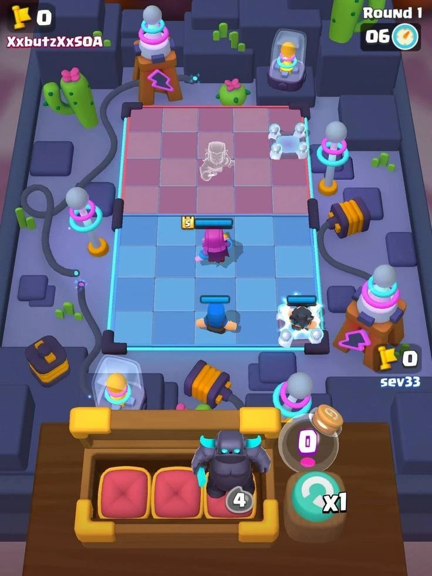
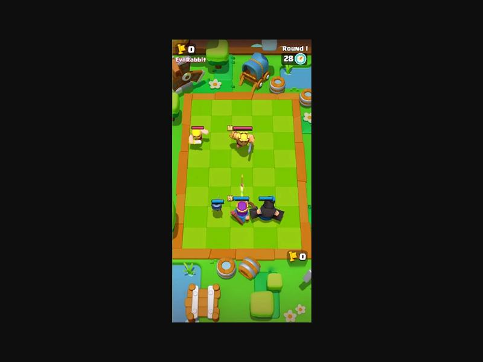

```
┌───────────────────────────┐
│ [깃발]0 닉네임   Round 1 [06⏱]│  ← 상단 HUD: 좌=상대, 우=라운드/타이머
│   ┌─────── 디오라마 ───────┐   │
│   │  ▦▦▦▦▦  (적 진영, 붉은 톤)│   │  ← 적 고스트 배치가 반투명으로 보임
│   │  ▦▦▦▦▦                 │   │
│   │  ━━━━━  (중앙선 = 기둥/포스트)│
│   │  ▦▦▦▦▦  (내 진영, 푸른 톤)│   │
│   └───────────────────────┘   │
│            [깃발]0 내 닉네임     │
│ ┌──── 나무 트레이(벤치) ────┐ [엘릭서 플라스크]│
│ │ [쿠션][쿠션][쿠션+미니]   │ [리롤 x1]     │  ← 하단 1/4 은 벤치 UI
│ └─────────────────────┘                  │
└───────────────────────────┘
```

- **카메라**: 약 55~60° 내려다보는 **원근(퍼스펙티브) 탑다운**, FOV 좁음(≈35°). 보드는 화면 가로의 70~75% 차지.
  위쪽(적 진영)이 약간 작아 보이는 원근감으로 "탁자 위 보드게임" 느낌.
- **보드는 화면 중앙보다 살짝 위**, 하단 25% 는 3D 로 렌더된 **나무 상자(트레이)** 가 차지 – UI 와 월드의 경계가 흐릿해 "장난감 상자"감을 줌.
- 보드 밖은 **디오라마 소품**이 꽉 채움 (빈 공간 없음): 나무·덤불·바위·통·수레·꽃·케이블·테슬라 코일.

### 2.2 컬러 팔레트

맵별로 테마가 명확히 다르지만 공통 규칙이 있다.

| 요소 | 숲(Goblin Forest) | 성(Castle) | 일렉트로 밸리 | 공통 규칙 |
|---|---|---|---|---|
| 내 진영 타일 | 연두/초록 체크 `#8FD14F / #7CC23F` | 베이지 체크 `#F0D7A8 / #E6C890` | 하늘 파랑 체크 `#8EC5F0 / #7AB4E6` | 2톤 체크, 명도 차 5~8% 로 **아주 은은** |
| 적 진영 타일 | 같은 초록 (라인으로 구분) | 동일 | 분홍/장미 `#D9A3B5 / #CC93A8` | 적 진영은 **붉은 기**, 내 진영은 **푸른 기** |
| 보드 테두리 | 주황 나무 레일 `#E89A3C` | 노랑 `#F5C542` | 시안 네온 `#39D5FF` | 테두리는 **가장 채도 높은 색**으로 보드를 오려냄 |
| 배경/지형 | 채도 높은 초록 `#6CC04A`, 물 `#6EC6E8` | 모래·돌 `#C9B38A` | 남보라 `#4A4E7A`, 짙은 청회색 블록 | 배경은 보드보다 **어둡거나 채도 낮음** → 보드가 주인공 |
| 팀 컬러 | 파랑 `#3FA9F5` (아군 HP바) | | | 빨강 `#F0506E` (적 HP바) |
| 강조 | 노랑 `#FFD23F`(별/레벨 뱃지), 마젠타 `#E040C8`(엘릭서) | | | |

**컬러 원칙 요약**
1. **고채도·고명도, 하지만 순색은 아님** – 모든 색에 약간의 흰기(파스텔 쪽)가 섞여 부드럽다.
2. **그림자는 검정이 아닌 보라/남색 계열** (`#3B3570` 쪽으로 틴트). 앰비언트가 하늘색이라 그림자에 푸른 기가 돈다.
3. 따뜻한 키라이트(연노랑) + 차가운 앰비언트(하늘색)의 **온도 대비**.
4. 캐릭터는 보드보다 채도가 높고 **림라이트**가 있어 배경과 분리된다.

### 2.3 모델링 / 데포르메

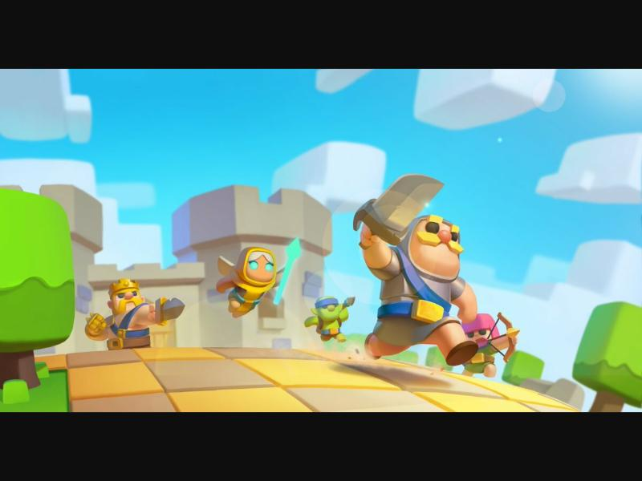
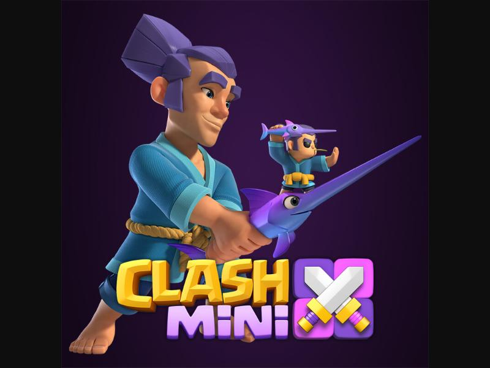

- **2~2.5 등신 치비**: 머리가 전체 높이의 40~45%. 몸통은 짧은 원통/달걀형, 팔다리는 짧고 굵은 원통, 손은 큰 주먹(구).
- **실루엣 우선**: 탑다운에서 보이는 건 **머리 윗면 + 어깨 + 무기**. 그래서 캐릭터 구분 요소가 전부 **머리 위**에 있다
  (바바리안 금발+뿔투구, 아처 분홍 후드, 킹 왕관, 위자드 보라 모자, 자이언트 대머리+큰 어깨, 고블린 초록 뾰족귀).
- **무기는 과장 확대**: 칼·망치가 몸 크기의 50~80% (스워드맨 렌더 참고).
- **베벨이 큰 로우~미들 폴리**: 날카로운 모서리 없음. 모든 박스형 소품(바위·블록·통)도 둥근 모서리.
- **표면**: 거의 단색 + 부드러운 그라디언트. 텍스처 디테일 최소, **재질감 대신 형태와 색으로** 읽히게 한다.
- **피규어 받침대**: 각 유닛은 원형 베이스 위에 서 있다(장난감 판타지). 전투 중엔 베이스 대신 **블롭 그림자 + 팀 컬러 링**으로 표현.
- **소품**: 나무는 구 2~3개를 겹친 "브로콜리형" 혹은 둥근 박스형 수관, 바위는 둥근 박스, 통은 원통+링.

### 2.4 조명 & 렌더링

- 소프트 셰이딩(셀셰이딩 아님). 라이트 방향은 **화면 좌상단 → 우하단**, 그림자가 오른쪽 아래로 짧게 떨어짐.
- 그림자는 부드럽고 **밝다**(불투명도 40~50%), 남보라 틴트.
- 캐릭터에 **흰색 림라이트/프레넬**, 보드 타일에 **아주 약한 AO**(타일 경계 살짝 어두움).
- 발광 요소(네온 테두리, 코일, 이펙트)는 **블룸**이 적극적으로 걸림.
- 외곽선(아웃라인) 없음 – 명도 대비와 림라이트로 분리.

### 2.5 UI 스타일

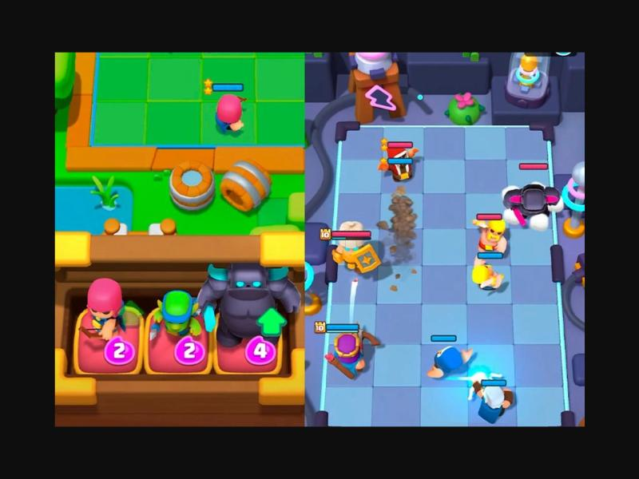
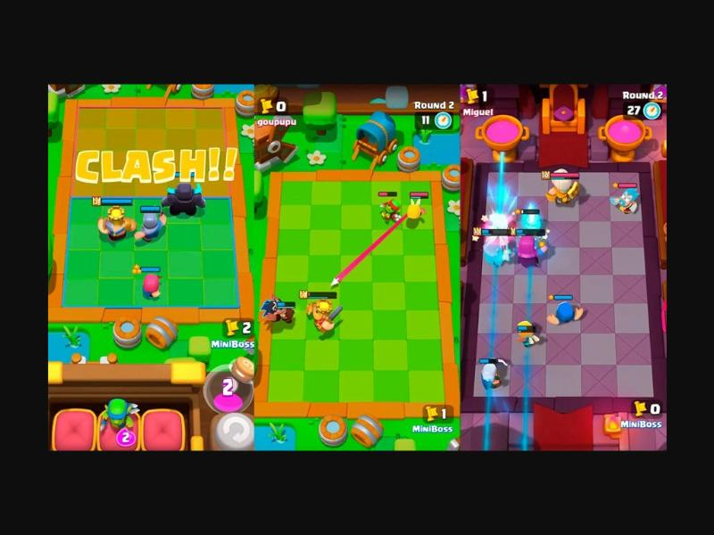

- **폰트**: 굵고 둥근 산세리프(Supercell-Magic 계열), **흰 글자 + 두꺼운 검정 외곽선 + 아래 드롭섀도**.
- **"CLASH!!" 배너**: 보드 중앙을 가로지르는 거대한 노랑 글자(주황→노랑 그라디언트, 갈색 외곽선). 스케일 펀치로 튀어나와 잠깐 머문 뒤 사라짐 → 전투 시작 신호.
- **HP 바**: 머리 위 짧은 캡슐. 아군 파랑 / 적 빨강, **검정 테두리**. 왼쪽에 **노란 레벨/별 뱃지**(작은 사각형에 숫자).
  에너지(슈퍼) 게이지는 HP 바 아래 얇은 노랑/보라 줄.
- **벤치 트레이**: 3D 나무 상자에 **빨간 방석 3개**, 미니 피규어가 방석 위에 서 있고 우하단에 **보라 원형 코스트 뱃지**.
  업그레이드 가능 미니는 **초록 위 화살표** 표시.
- **엘릭서 플라스크**: 둥근 유리병 안에 마젠타 액체 + 큰 숫자. 코르크 뚜껑.
- **리롤 버튼**: 청록 원형 버튼 + 회전 화살표 아이콘 + "x1".
- **깃발(트로피) 카운터**: 노란 깃발 아이콘 + 숫자. 상대는 좌상단, 나는 보드 우하단.
- 경고 텍스트("Not enough Elixir!")는 화면 중앙에 **분홍 글자**로 짧게 흔들리며 표시.

### 2.6 애니메이션의 "쫄깃함" 분석

스크린샷·영상 리뷰에서 관찰되는 모션 원칙:

| 상황 | 관찰 | 재현 파라미터(제안) |
|---|---|---|
| 배치(드롭) | 위에서 떨어져 **쿵** → 세로로 눌렸다(0.7) 튀어오름(1.15) → 안착. 먼지 링 | 낙하 0.12s, 스쿼시 0.08s, 오버슛 back-ease 0.25s |
| 대기(Idle) | 제자리 **숨쉬기**(Y 스케일 ±4%, 1.2s 주기), 좌우 약간 흔들림 | sin 파형, 유닛별 위상 랜덤 |
| 이동 | 걷기라기보다 **통통 튀는 홉**. 몸이 앞으로 기울고 매 스텝 작은 스쿼시 | 홉 높이 0.08, 주기 0.28s, 기울기 10° |
| 공격 | **예비동작(뒤로 젖힘) → 빠른 휘두름 → 짧은 정지** | 안티시페이션 0.12s, 스윙 0.06s, 팔로우 0.15s |
| 피격 | 0.08s **하얀 플래시**, 뒤로 살짝 밀림 + 스쿼시, 데미지 숫자 튀어오름 | flash 0.08s, knock 0.1 유닛 |
| 강타/슈퍼 | **히트스톱**(0.05~0.08s) + 카메라 셰이크 + 큰 링 충격파 | timescale 0.05, shake 0.25s |
| 사망 | 넘어지며 회전 → **연기 퍼프(흰 구름)** 속에 사라짐 → 작은 별/코인 튐 | 0.35s |
| 합성 업 | 빛 기둥 + 스케일 펀치(1.35) + 별 뱃지 튀어오름 | 0.4s |
| UI 버튼 | 누를 때 0.9 → 뗄 때 1.1 → 1.0 (탄성) | elastic out 0.3s |

핵심: **모든 움직임에 오버슛(back/elastic 이징)**, 선형 이동 거의 없음. 짧고 빠르게 → 정지 → 여운.

### 2.7 VFX 분석

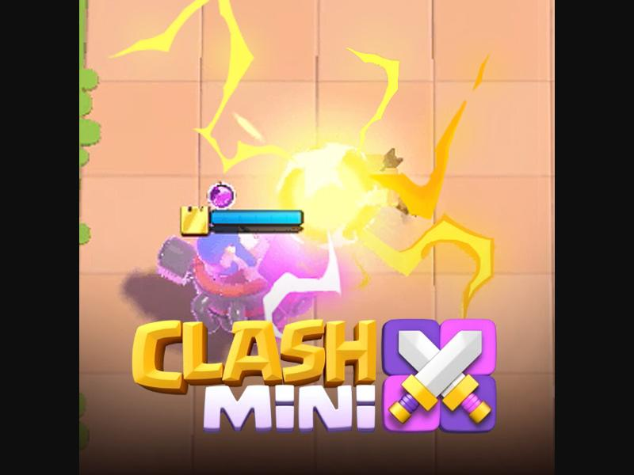
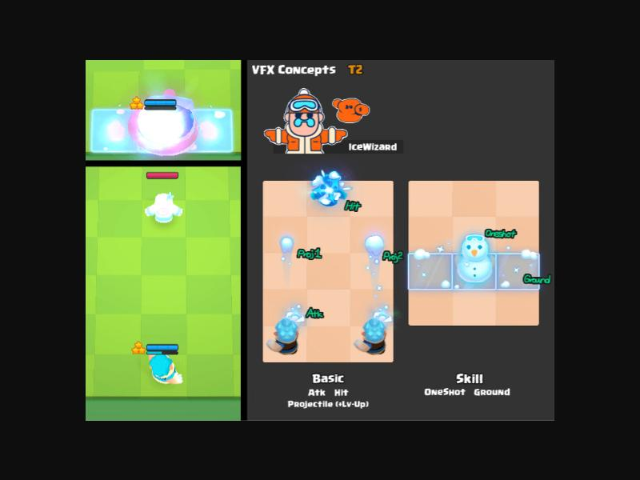
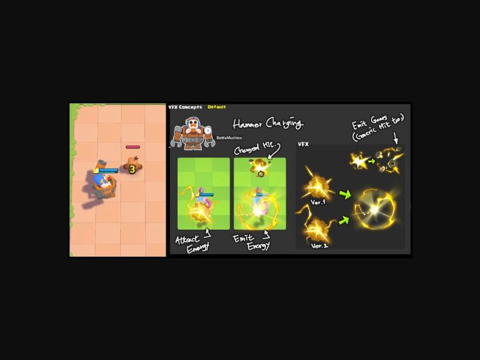
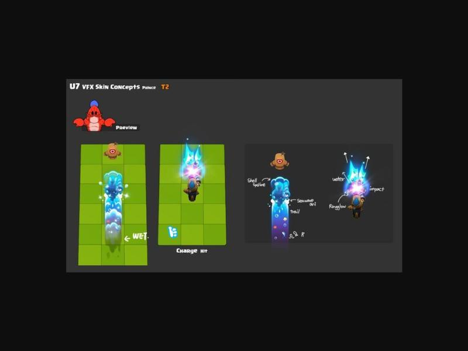
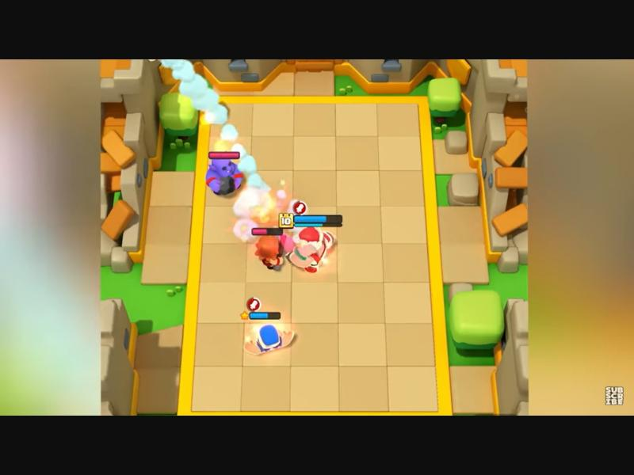

외주 VFX 스튜디오(OCTOPO) 컨셉 시트에서 확인되는 **Clash Mini VFX 문법**:

1. **Basic 공격 VFX 3단 구성**: `Atk(발사 섬광) → Projectile(투사체 + 트레일) → Hit(타격 섬광)`.
   레벨업 시 투사체가 한 단계 커지거나 추가됨 ("Projectile (+Lv-Up)").
2. **Skill VFX 2단 구성**: `OneShot(순간 폭발/오브젝트)` + `Ground(바닥 타일 장판)`.
   → **타일 단위로 바닥을 칠하는 장판**이 매우 많다 (얼음 장판이 정확히 타일 3칸).
3. **형태**: 부드러운 구름·퍼프(흰색 볼륨), 날카로운 지그재그(번개), 별 모양 스파크, 링 충격파. 모두 **두꺼운 셰이프 + 선명한 가장자리**. 노이즈 연기보다 "만화 구름 덩어리".
4. **색**: 중심은 거의 흰색(과노출) → 바깥은 원색(노랑/시안/마젠타). **코어는 흰색, 가장자리 채도** 원칙.
5. **타이밍**: 빌드업(흡수 "Attract Energy") → 방출("Emit Energy") → 잔여 파편("Emit Gears"). 방출 순간이 가장 크고, 1~2 프레임만.
6. 먼지·흙 파편(자이언트/바바리안 돌진 시 갈색 흙덩이)이 이동에도 따라붙음.
7. 파이어볼은 **흰 연기 트레일이 아치형**으로 남는다 (성 보드 스크린샷).

### 2.8 게임 필 요약 (재현 체크리스트)

- [ ] 탁자 위 장난감 디오라마 – 보드 밖을 소품으로 가득
- [ ] 2톤 체크 타일, 진영 색 대비(파랑/빨강), 채도 높은 테두리
- [ ] 2~2.5등신, 머리 위에서 읽히는 실루엣, 과장된 무기
- [ ] 따뜻한 키라이트 + 하늘색 앰비언트, 보라 틴트 그림자, 림라이트, 블룸
- [ ] 모든 모션에 스쿼시&스트레치와 오버슛, 홉 이동
- [ ] 공격 3단(예비-타격-여운), 피격 플래시, 히트스톱, 셰이크
- [ ] VFX: 흰 코어 + 원색 외곽, 구름 퍼프, 별 스파크, 링 충격파, 타일 장판
- [ ] 굵은 외곽선 폰트, CLASH!! 배너, 벤치 트레이 + 엘릭서 병

---

## 3. 시장/디자인 평가 요약

- **잘 된 점**: 오토체스의 진입장벽을 크게 낮춤(체력·레벨·아이템 제거), 짧은 세션, 배치 가독성, 캐릭터 매력.
- **문제점(Deconstructor of Fun)**: 깊이 부족·예측 가능성 → 이후 재배치 금지/클래스 시너지 도입.
  가챠형 유닛 획득(토이 머신)과 중간 보상 부족으로 수익화 부진, 2년 넘는 소프트런칭 끝에 중단.
- **프로토타입 시사점**: 우리는 메타(수집/수익)는 배제하고 **코어 전투의 손맛과 보는 재미**만 검증한다.

---

## 4. 출처

- [Clash Mini Wiki – Round](https://clashmini.fandom.com/wiki/Round) / [Minis](https://clashmini.fandom.com/wiki/Minis) / [Version History](https://clashmini.fandom.com/wiki/Version_History) / [Magic Tiles](https://clashmini.fandom.com/wiki/Magic_Tiles)
- [The Why of Play – Clash Mini Early Review](https://thewhyofplay.com/2021/11/28/clash-mini-early-review/)
- [Deconstructor of Fun – Clash Mini Faces the Make it or Break it Moment](https://www.deconstructoroffun.com/blog/2024/1/7/clash-mini-faces-their-make-it-or-break-it-moment)
- [LDPlayer – Clash Mini Beginner's Guide](https://www.ldplayer.net/blog/clash-mini-beginners-guide.html)
- [GamingonPhone – Beginners Guide](https://gamingonphone.com/guides/clash-mini-beginners-guide-and-tips/)
- [Uptodown – What is Clash Mini](https://blog.en.uptodown.com/clash-mini-and-clash-royale-heroes-difference/) (refs 01, 02)
- [Mobi.gg](https://images.mobi.gg/uploads/2024/11/clash-mini-gameplay.webp) (ref 03), [MobileMatters](https://mobilematters.gg/gaming/clash-mini-release-date-pre-registration-minis-gameplay-more) (ref 04), [Malavida](https://www.malavida.com/) (ref 05), [games.lol](https://games.lol/) (ref 06), [TapTap](https://www.taptap.io/) (ref 12)
- [OCTOPO VFX Studio – Clash Mini VFX (ArtStation)](https://octopovfx.artstation.com/projects/yJdL0Q) (refs 07, 08, 09, 11)
- [Ocellus – Clash Mini Swordsman (ArtStation)](https://www.artstation.com/) (ref 10)
- 유닛 수치: 커뮤니티 위키/[noff.gg](https://www.noff.gg/clash-mini/stats) 검색 결과 요약 (버전에 따라 상이)

> 참고 이미지는 분석 목적의 내부 레퍼런스이며 저작권은 각 권리자(Supercell 등)에 있다. 프로토타입의 모든 에셋은 Godot 프리미티브로 **직접 절차적 생성**하며 원작 에셋을 사용하지 않는다.
