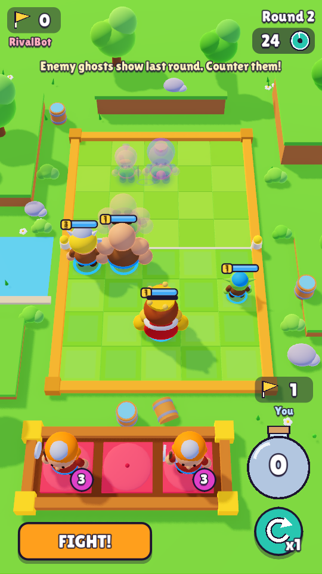
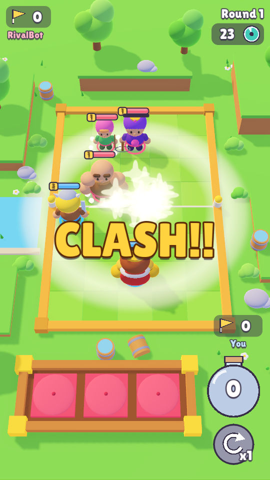
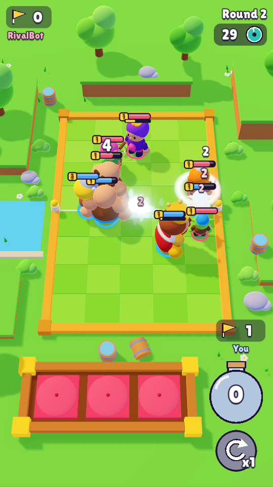
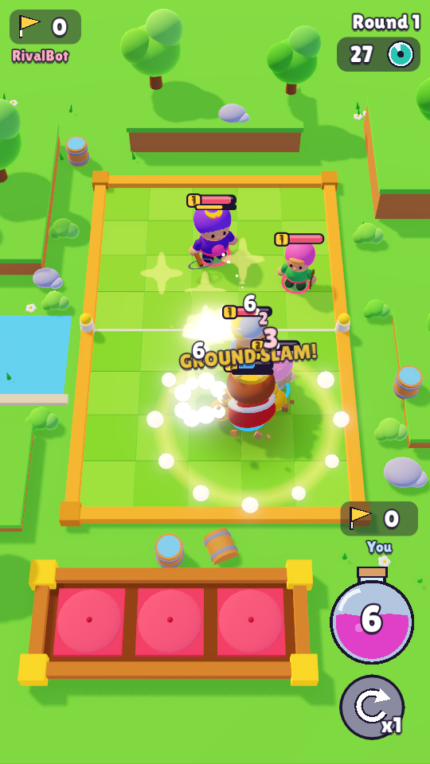
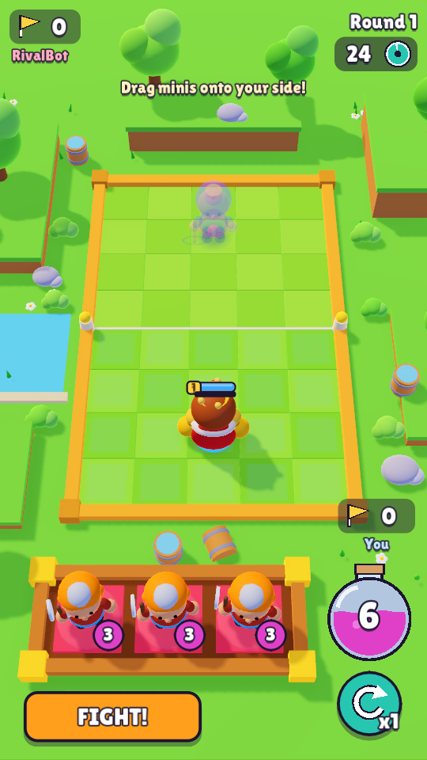
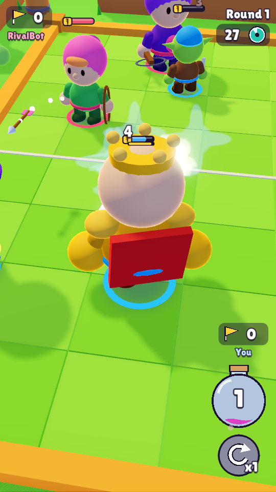

# 기획서 — TOY CLASH (가제)
### Clash Mini 스타일 오토배틀러 · Godot 4 재현 프로젝트

| 항목 | 내용 |
|---|---|
| 문서 버전 | v0.1 (프로토타입 기준) |
| 엔진 | Godot 4.7 (GDScript, Forward+) |
| 플랫폼 | PC 프로토타입 (세로 9:16, 모바일 전환 전제) |
| 레퍼런스 | Supercell *Clash Mini* — 분석은 [`01_리서치_클래시미니_분석.md`](01_리서치_클래시미니_분석.md) |
| 핵심 목표 | **"탁자 위 장난감 피규어가 통통 튀며 싸우는 손맛"** 을 재현하고 검증 |

---

## 0. 한 줄 요약

> 5×8 보드 위에 데포르메된 장난감 피규어를 배치하고, **CLASH!!** 신호와 함께 자동 전투를 지켜보는 3분짜리 전략 보드게임.
> 규칙은 단순하게, **보는 맛(모델·컬러·모션·VFX)** 은 최대한 풍성하게.

---

## 1. 디자인 필러 (Pillars)

1. **장난감 디오라마 판타지** — 모든 것은 테이블 위 보드게임. 받침대, 나무 트레이, 둥근 소품, 부드러운 조명.
2. **쫄깃한 모션** — 선형 움직임 금지. 모든 동작에 예비동작·스쿼시&스트레치·오버슛.
3. **한눈에 읽히는 전투** — 작은 숫자(HP 10~40, 데미지 2~6), 탑다운에서 읽히는 실루엣, 진영 색 대비.
4. **짧고 강한 한 판** — 라운드당 배치 25초 + 전투 ≤30초, 먼저 깃발 2개면 승리.

---

## 2. 코어 루프

```
[매치 시작] ─▶ [배치 페이즈] ─▶ [CLASH!!] ─▶ [전투 페이즈] ─▶ [라운드 결과] ─┐
                  ▲  엘릭서 +6 / 트레이 3장 / 리롤                         │
                  └──────────── 깃발 2개 미만 ◀───────────────────────────┘
                                   깃발 2개 ▶ [매치 결과: VICTORY / DEFEAT]
```

### 2.1 배치 페이즈 (25초, "FIGHT!" 버튼으로 조기 종료)
- 라운드 시작 시 **엘릭서 +6** (이월, 최대 10).
- 나무 트레이에 덱(6종)에서 **랜덤 미니 3개**가 올라온다.
- 트레이의 미니를 **드래그 → 내 진영(아래 4줄) 빈 타일에 드롭** = 구매+배치.
- 이미 있는 **같은 미니 위에 드롭** = **스타 업그레이드**(최대 3★). 비용 동일.
- 보드 위 내 유닛은 배치 페이즈 동안 **드래그로 재배치 가능**.
- **리롤**: 라운드당 1회 무료, 쓰지 않으면 누적.
- 보드 제한: 히어로 1 + 미니 5.
- **적의 직전 라운드 배치가 반투명 고스트로 보인다** → 카운터 배치 판단. 새로 추가된 적 유닛은 CLASH 순간 공개.

### 2.2 전투 페이즈 (최대 30초)
- 개입 불가. 각 유닛이 가장 가까운 적(아처는 가장 먼 적)을 향해 자유 이동 후 공격.
- 전투 시작 순간 **Clash 능력** 발동(고블린 도약 등).
- 히어로는 **에너지**(공격 시 +20, 피격 시 +8)가 100이 되면 **Super** 발동.
- 한쪽 전멸 시 종료. 30초 초과 시 **남은 HP 비율 합**이 높은 쪽 승리, 같으면 무승부.

### 2.3 라운드 결과
- 승리 측 깃발 +1. 무승부는 깃발 없음.
- 모든 유닛은 다음 라운드에 **배치했던 자리에서 부활**(보드는 누적 성장).
- 깃발 2개 선취 시 매치 종료 (최대 5라운드, 이후 깃발 많은 쪽 / 동률은 무승부).

---

## 3. 유닛 설계

### 3.1 스탯 기준
- 별(★) 당 HP·공격력 **×1.5 누적 가산** (1★=1.0, 2★=1.5, 3★=2.0), 모델 스케일 +8%.
- 수치는 Clash Mini의 "작은 숫자" 스케일을 따른다.

### 3.2 유닛 표 (프로토타입 수록)

| 유닛 | 역할 | 비용 | HP | 공격 | 주기(s) | 사거리 | 이속 | 능력 |
|---|---|---|---|---|---|---|---|---|
| **King** (히어로·아군) | 탱커/브루저 | – | 40 | 4 | 1.2 | 0.95 | 1.3 | **Super: 그라운드 슬램** – 반경 1.7 광역 6 피해 + 넉백, 히트스톱·셰이크 |
| **Queen** (히어로·적) | 원거리 딜러 | – | 30 | 3 | 1.1 | 3.8 | 1.3 | **Super: 3연발** – 서로 다른 적 3명에게 화살 |
| Brawler | 근접 딜러 | 2 | 16 | 2 | 0.9 | 0.9 | 1.7 | Passive: 잃은 HP 비율만큼 공속 최대 +60% |
| Archer | 원거리 | 2 | 9 | 2 | 1.1 | 3.6 | 1.4 | Passive: **가장 먼 적** 조준 (화살 포물선) |
| Goblin | 암살 | 2 | 10 | 2 | 0.6 | 0.85 | 2.5 | Clash: 가장 가까운 적에게 **도약** |
| Wizard | 광역 원거리 | 3 | 12 | 2 | 1.5 | 3.2 | 1.3 | 파이어볼 반경 1.0 광역 |
| Valkyrie | 광역 근접 | 3 | 20 | 2 | 1.2 | 0.95 | 1.5 | 회전베기 – 주변 반경 1.1 전체 타격 |
| Giant | 탱커 | 4 | 34 | 4 | 1.6 | 0.95 | 0.95 | Clash: 가장 가까운 적을 향해 **돌진**(이속 2배 1.5초) |

### 3.3 실루엣 가이드 (탑다운 가독성)
| 유닛 | 머리 위 식별 요소 | 주색 | 무기 |
|---|---|---|---|
| King | 금 왕관 + 흰 수염 + 망토 | 금/적갈 | 큰 금 주먹 |
| Queen | 보라 머리 + 왕관 | 보라/분홍 | 석궁 |
| Brawler | 금발 + 뿔 투구 | 노랑/갈색 | 큰 칼 |
| Archer | 분홍 후드 | 분홍/초록 | 활 |
| Goblin | 초록 피부 + 뾰족 귀 | 연두 | 단검 |
| Wizard | 보라 뾰족 모자 | 보라/파랑 | 불꽃 손 |
| Valkyrie | 주황 땋은 머리 | 주황/갈색 | 양날도끼 |
| Giant | 대머리 + 넓은 어깨 | 살색/갈색 | 맨주먹(대형) |

---

## 4. 아트 디렉션 (리서치 반영)

### 4.1 모델링 — 절차적 데포르메
- **2~2.5등신**: 머리 = 전체 높이의 40~45%. 몸통은 달걀형, 팔다리는 짧은 원통, 손은 큰 구.
- 모든 형태는 **구·캡슐·원통·둥근 박스** 조합(날카로운 모서리 없음) → Godot 프리미티브로 생성.
- 무기는 몸의 50~80% 크기로 과장.
- 각 유닛 발밑: **팀 컬러 링**(파랑/빨강) + **블롭 그림자**.
- 벤치 트레이에서는 받침대 위 피규어로 보여 "장난감" 판타지 강조.

### 4.2 컬러 스크립트 (맵: 숲 보드)
| 용도 | 색 |
|---|---|
| 타일 A / B | `#9BD85A` / `#88CB4A` |
| 보드 테두리 레일 | `#F0A040` (주황 나무) |
| 지형 잔디 | `#6DBE45`, 절벽 흙 `#B77B45` |
| 물 | `#63C5EA` |
| 아군 / 적군 | `#3FA9F5` / `#F0506E` |
| 강조(별·레벨) | `#FFD23F` |
| 엘릭서 | `#E040C8` |
| 그림자 틴트 | `#3B3570` (앰비언트 하늘색 → 보라 그림자) |

### 4.3 조명 / 렌더
- DirectionalLight: 따뜻한 연노랑, 좌상단→우하단, 소프트 섀도 불투명도 ~55%.
- Ambient: 하늘색-라벤더(그림자가 보라로 틴트되도록).
- 캐릭터 머티리얼: 소프트 셰이딩 + **림(Rim) 0.5**.
- Post: Filmic/ACES 톤맵, Glow(블룸), 채도 +15%, SSAO 약하게.
- 카메라: 원근, FOV ~34°, 약 58° 내려다봄, 세로 화면에서 보드 폭 75%.

### 4.4 UI
- 폰트: 굵고 둥근 산세리프, **흰 글자 + 검정 외곽선 6~10px + 드롭섀도**.
- 상단: 좌 = 상대 깃발/이름, 우 = `Round N` + 원형 타이머.
- HP 바: 머리 위 캡슐, 검정 테두리, 좌측 노란 별 뱃지, 히어로는 아래 에너지 바.
- 하단: 3D 나무 트레이(빨간 방석 3개) + 보라 코스트 뱃지, 우측 **엘릭서 플라스크** 와 **리롤 버튼**, **FIGHT!** 버튼.
- 배너: `CLASH!!` (노랑 그라디언트, 스케일 펀치), `ROUND WIN / LOSE / DRAW`, `VICTORY / DEFEAT`.
- 경고: `Not enough Elixir!` 분홍 텍스트 흔들림.

---

## 5. 애니메이션 명세 ("쫄깃함")

모든 파라미터는 `scripts/tuning.gd` 성격의 상수로 모아 조정 가능하게 한다.

| 이벤트 | 연출 | 파라미터 |
|---|---|---|
| 배치 드롭 | 1.2 높이에서 낙하 → 스쿼시(1.3, 0.65) → 스트레치(0.9, 1.15) → 안착 + 먼지 링 + "뽁" | 낙하 0.14s, 회복 0.3s back-ease |
| 드래그 중 | 유닛이 들림(+0.5), 흔들림 회전, 타일 하이라이트, 그림자 남김 | – |
| Idle | 숨쉬기 Y ±4%, 1.1~1.4s, 위상 랜덤 | sin |
| 이동 | 홉(높이 0.1, 주기 0.26s), 진행방향 전경사 10°, 착지 스쿼시 | |
| 공격(근접) | 뒤로 젖힘 0.12s → 전진 런지 0.06s → 복귀 0.18s, 팔 스윙 | 타격은 런지 끝 프레임 |
| 공격(원거리) | 뒤로 젖힘 → 반동 → 투사체 발사 | |
| 피격 | 흰 플래시 0.08s, 스쿼시, 넉백 0.08, 데미지 숫자 팝 | |
| 슈퍼 | 점프 0.35s → 내려찍기, 히트스톱 0.09s, 셰이크 0.5 | |
| 사망 | 뒤로 넘어짐 + 수축 0.3s → 연기 퍼프 + 별 파편 | |
| 스타업 | 스케일 펀치 1.4, 빛 기둥, 별 뱃지 팝 | |
| UI 버튼 | 눌림 0.9 → 탄성 1.08 → 1.0 | elastic 0.3s |
| 배너 | 0 → 1.25 → 1.0 (back), 유지 후 1.1 + 페이드 | |

---

## 6. VFX 명세

원칙(리서치 2.7): **흰 코어 + 원색 외곽**, 두꺼운 셰이프, 만화 구름 퍼프, 별 스파크, 링 충격파, 방출 순간 1~2프레임 최대.

| ID | 트리거 | 구성 |
|---|---|---|
| `dust_ring` | 배치 착지, 슬램 | 흰-베이지 퍼프 구 8개 방사 확산 + 페이드 |
| `hit_spark` | 근접 타격 | 흰 별 1(팝) + 컬러 스파크 6~8 파티클 + 작은 링 |
| `arrow` | 아처/퀸 | 화살 메쉬 포물선 비행 + 흰 트레일 퍼프 |
| `fireball` | 위자드 | 주황 발광구+흰 코어, 연기 트레일 아치 → 폭발(큰 퍼프 + 주황 링 + 스파크 + 그을음) |
| `spin_slash` | 발키리 | 몸 주변 반투명 원판 회전 + 바람 링 |
| `slam` | 킹 슈퍼 | 대형 충격파 링 2중 + 흙 파편(중력) + 먼지 + 셰이크 + 히트스톱 |
| `leap_trail` | 고블린 Clash | 초록 스피드 퍼프 |
| `charge_dust` | 자이언트 Clash | 발밑 흙먼지 연속 |
| `death_poof` | 사망 | 흰 구름 퍼프 8 + 노랑 별 4 |
| `upgrade_pillar` | 스타업 | 노랑 빛 기둥 + 상승 스파클 |
| `clash_flash` | CLASH!! | 화면 흰 플래시 + 중앙선 섬광 |
| `confetti` | VICTORY | 다색 사각 종이 파티클 |

---

## 7. 사운드 (프로토타입: 절차적 합성)
에셋 없이 코드로 합성한 짧은 효과음: `pop`(배치), `thud`(타격), `whoosh`(스윙/투사체), `boom`(폭발/슬램), `poof`(사망), `chime`(스타업), `fanfare`(승리), `tick`(타이머 5초 이하).

---

## 8. AI (상대)
- 같은 규칙(엘릭서/트레이/리롤)으로 구매.
- 우선순위: ① 업그레이드 가능(★<3) ② 가장 비싼 구매 가능 유닛 ③ 쓸만한 게 없으면 리롤 1회.
- 배치: 근접/탱커는 중앙선 가까운 줄, 원거리는 뒷줄, 열은 분산.

---

## 9. 기술 설계 (Godot)

```
project.godot            세로 720×1280, canvas_items stretch
scenes/Main.tscn         루트 Node3D + main.gd (나머지는 코드로 절차 생성)
scripts/
  main.gd                게임 상태 머신(INTRO/DEPLOY/CLASH/BATTLE/RESULT/END), 입력, 라운드 흐름
  data.gd                유닛 정의(스탯/색/능력) — 데이터 드리븐
  unit.gd                유닛 런타임(상태·타겟팅·이동·공격·에너지·연출 훅)
  unit_model.gd          절차적 치비 모델 빌더(파츠 피벗 → 애니메이션)
  world.gd               보드/타일/디오라마 소품/조명/환경 생성
  tray.gd                3D 벤치 트레이(방석, 미니 피규어, 코스트 뱃지)
  vfx.gd                 VFX 팩토리(퍼프·스파크·링·투사체·파티클)
  hud.gd                 2D HUD(상단 정보, HP바, 데미지 숫자, 배너, 버튼)
  camera_rig.gd          셰이크(trauma), 히트스톱
  sfx.gd                 절차적 효과음 합성/재생
  ai.gd                  상대 구매·배치
```

- **연출 분리 원칙**: 게임 로직(`unit.gd`, `main.gd`)은 "사건"만 발생시키고, 연출은 `vfx.gd`·`unit_model.gd`·`hud.gd`·`sfx.gd` 가 담당 → 파라미터 튜닝과 교체가 쉬움.
- 드래그&드롭은 물리 없이 **카메라 레이 ↔ y=0 평면 교차**로 처리.
- 히트스톱: `Engine.time_scale` 순간 저하 + 시간 무시 타이머로 복구.
- 자동 검증: `-- --autoplay --shots=<dir>` 인자로 AI 대 AI 자동 플레이 + 스크린샷 저장.

---

## 10. 우선순위 & 범위

| 우선순위 | 기능 | 프로토타입 |
|---|---|---|
| **P0** | 5×8 보드, 배치/전투 라운드 루프, 엘릭서, 트레이 3장, 드래그 배치 | ✅ |
| **P0** | 유닛 6종 + 히어로 2종, 자동 타겟팅/이동/공격 | ✅ |
| **P0** | 데포르메 모델, 컬러/조명/포스트, 숲 디오라마 | ✅ |
| **P0** | 핵심 모션(드롭·홉·공격·피격·사망), 핵심 VFX, CLASH 배너, HP바 | ✅ |
| **P1** | 스타 업그레이드(합성), 리롤, 적 고스트, 히어로 슈퍼, Clash 능력 | ✅ |
| **P1** | 히트스톱/셰이크, 데미지 숫자, 절차적 SFX, 승리 연출 | ✅ |
| P2 | 매직 타일, 클래스 시너지, 히어로 선택, 맵 3종 테마 | ⏳ |
| P2 | 메타: 덱 편집, 컬렉션, 트로피 로드 | ⏳ |
| P3 | 온라인 대전, 4인 럼블, 스킨/이모트 | ⏳ |

---

## 11. 로드맵
1. **M0 – 프로토타입 (현재)**: 코어 루프 + 게임 필 검증.
2. **M1 – 버티컬 슬라이스**: 맵 3종(숲/성/일렉트로), 매직 타일, 유닛 12종, 시너지, 실제 모델링 에셋 교체 파이프라인(glTF).
3. **M2 – 알파**: 덱 빌딩, 메타 성장, 모바일 입력/성능 최적화(Mobile 렌더러).

## 12. 검증 지표 (프로토타입 플레이테스트)
- 첫 배치까지 걸린 시간 < 5초 (조작 직관성)
- 라운드당 "와" 모먼트(슬램/폭발/연속 처치) ≥ 1회
- 매치 길이 2~4분
- "보드 위 장난감 같다" 정성 피드백

---

## 13. 프로토타입 구현 결과 (M0)

실행 방법과 조작은 [`README.md`](../README.md) 참고. 아래는 `--autoplay --shots` 로 자동 캡처한 실제 게임 화면입니다.

| 배치 (적 고스트) | CLASH!! | 전투 |
|---|---|---|
|  |  |  |
| **킹 슈퍼: 그라운드 슬램** | **벤치 트레이** | **근접 카메라 (모델)** |
|  |  |  |

### 13.1 리서치 → 구현 매핑
| 리서치 관찰 | 구현 |
|---|---|
| 탁자 위 디오라마, 보드 밖을 소품으로 채움 | `world.gd`: 잔디 턱이 있는 박스형 지형, 브로콜리 나무, 덤불, 바위, 통, 꽃, 연못 |
| 2톤 체크, 채도 높은 테두리 | `#86cf45 / #74c03a` 체크, 주황 레일, 중앙선 포스트 |
| 따뜻한 키라이트 + 하늘색 앰비언트, 보라 그림자 | 연노랑 Directional + 라벤더 앰비언트 `#b3bdff`, 블롭 그림자 `#3b3570` 틴트 |
| 림라이트, 블룸, 고채도 | 머티리얼 Rim 0.3, Glow(Screen), 채도 1.3, 대비 1.1, SSAO |
| 2~2.5등신, 머리 위에서 읽히는 실루엣 | `unit_model.gd`: 큰 머리와 유닛별 식별 요소(왕관, 후드, 뿔투구, 뾰족귀, 마법사 모자, 땋은 머리) |
| 받침대 피규어 | 팀 컬러 발광 링 + 블롭 그림자, 트레이에서는 방석 위 피규어 |
| 드롭 스쿼시, 홉 이동, 공격 3단 | 낙하 → 스쿼시(1.35, 0.62) → 탄성 복귀, 사인 홉 + 전경사, 예비동작 → 스윙 → 백 이징 복귀 |
| 피격 플래시, 히트스톱, 셰이크 | 이미시브 화이트 플래시, `Engine.time_scale` 0.04 히트스톱, trauma² 셰이크 |
| VFX 문법 (흰 코어 + 원색 외곽, 퍼프, 별, 링) | `vfx.gd`: HDR 흰 코어 스프라이트, 구름 퍼프 메쉬, 별 파티클, 지면 링, 그을음, 흙 파편 |
| 공격 VFX 3단 (Atk → Projectile → Hit) | 화살/파이어볼 포물선 투사체 + 트레일 퍼프 + 타격 스파크/폭발 |
| 굵은 외곽선 폰트, CLASH!! 배너, 엘릭서 병, 리롤 | `hud.gd`: 외곽선과 드롭섀도 라벨, 스케일 펀치 배너, 출렁이는 엘릭서 병, 청록 원형 리롤 |
| 적 직전 배치 고스트 | 배치 중 적 기존 유닛은 반투명, 새 유닛은 CLASH 순간 낙하 공개 |

### 13.2 검증
- 헤드리스 스크립트 컴파일과 40초 자동 플레이를 에러 없이 통과.
- `--selftest`: 트레이 드래그 배치(엘릭서 10 → 8), 같은 미니 합성(★2, 엘릭서 → 6), 적 진영 드롭 거부, 유닛 재배치를 모두 통과.
- 렌더 캡처로 승리와 패배 양쪽 매치 종료 흐름을 확인.

### 13.3 알려진 한계와 다음 단계
- 모델은 프리미티브 조합이라 원작 수준의 실루엣 디테일(의상 주름, 손 모양)이 부족함. M1에서 glTF 에셋 교체 파이프라인으로 대체.
- 사운드는 합성음 수준. 실제 SFX와 BGM은 M1.
- 밸런스는 1차 수치. 유닛 간 상성과 라운드 길이 튜닝이 필요.
- 매직 타일, 클래스 시너지, 히어로 선택, 맵 3종 테마는 P2.
