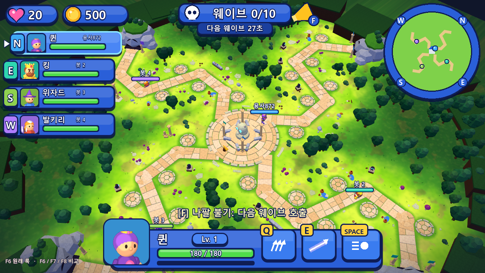
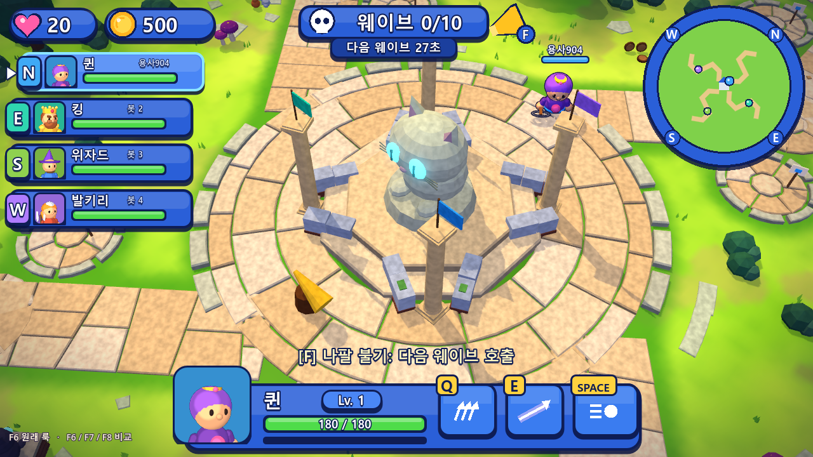
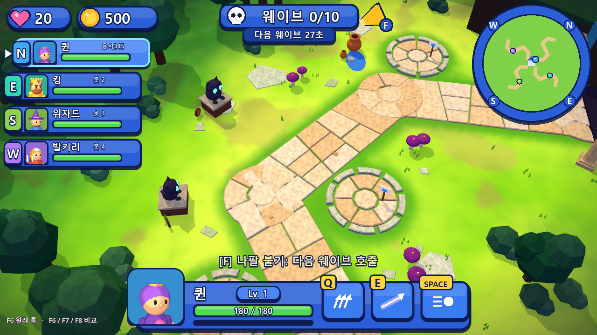
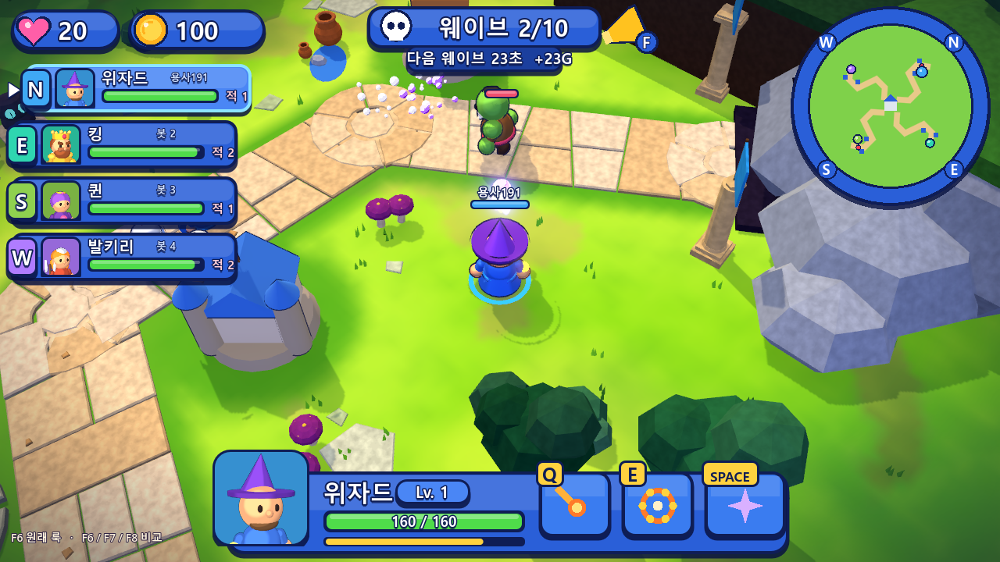

# TOY RUSH — 4인 협동 영웅 디펜스 (Godot 4 프로토타입)

킹덤러시의 라인 디펜스(고정 경로, 건설 부지, 타워 4종, 블로킹, 조기 호출, 공용 골드와 생명)에
**각 플레이어가 영웅을 WASD와 마우스로 직접 조종**하는 4인 협동을 합친 게임입니다.
비주얼은 TOY CLASH의 장난감 디오라마 스타일(데포르메 피규어, 고채도, 쫄깃한 모션, 만화풍 VFX)을 계승하고,
v0.3에서 **밝은 모바일 키아트 레퍼런스 톤**(하이키 조명, 반구 앰비언트, 부드러운 셀 캐릭터, 로열 블루 UI)으로 전면 조정했습니다.
모든 모델, 텍스처, 사운드는 코드로 절차 생성합니다.



## 맵 아트: 고양이 유적 아레나
Sketchfab 「3D Cat Arena Environment」(Omar Mendoza Escalera, `docs/refs/cat_arena_reference.jpg`)의 핸드페인팅 스타일로 맵을 꾸몄습니다. 구현은 `scripts/arena.gd`에 있으며 게임 판정에는 영향이 없습니다.
- **컬러 톤**: 주변은 어두운 남색 밤입니다. 길 주변 잔디만 형광 라임으로 빛나고 멀어질수록 짙은 숲색으로 가라앉습니다. 카메라를 따라다니는 조명과 화면 비네트도 들어갑니다.
- **길·건설 부지**: 금 간 모래색 석판을 비스듬한 이음매로 깔았고, 꺾이는 곳은 둥근 석판 로제트로 처리했습니다. 건설 부지는 석판 원판에 흰 돌 링을 둘렀습니다.
- **중앙 성**: 고양이 석상 신전입니다. 계단식 제단, 깃발 기둥 4개, 길 쪽이 열린 폐허 벽, 빛나는 청록색 눈으로 구성했습니다. 광장 바깥은 흰 돌 봉인 링이 감싸며, 길이 들어오는 곳만 열려 있습니다.
- **소품**: 그리스식 기둥(서 있는 것, 부러진 것, 쓰러진 것), 노란 점박이 보라 버섯, 물이 쏟아진 토기 항아리, 벽돌 기단 폐허 벽과 물약 선반, 검은 고양이 석상, 통나무 단면, 청회색 바위, 잔디 위 깨진 판석을 길가에 군집으로 배치했습니다. 나무는 바깥쪽의 어두운 로우폴리입니다.
- 이전 맵은 `--classic-map` 인자로 볼 수 있습니다.

| 신전 | 라인 | 전투 |
|---|---|---|
|  |  |  |

## 문서
- [docs/01_리서치_킹덤러시_분석.md](docs/01_리서치_킹덤러시_분석.md): 킹덤러시 규칙, 재화, 레벨 디자인, 시각 분석, 협동 하이브리드 비교
- [docs/02_기획서_TOY_RUSH.md](docs/02_기획서_TOY_RUSH.md): 기획서와 구현 결과(스크린샷 포함)

## 실행
- **실행 파일**: `build/ToyRush.exe` (같은 폴더의 `ToyRush.pck`, `GodotSharp/`가 함께 있어야 함), 배포용 압축본은 `ToyRush_Windows.zip`
- **에디터**: Godot 4.7로 `toy_rush/` 폴더를 열고 F5

## 조작
| 입력 | 동작 |
|---|---|
| W A S D | 이동 (화면 기준) |
| 마우스 / 좌클릭(누르기) | 조준 / 기본 공격 |
| Q / E | 영웅 스킬 |
| SPACE | 이동기 (방패 돌진 / 구르기 / 블링크 / 도약 강타 / 빛의 질주) |
| F | 부지: 건설 링 메뉴, 타워: 업그레이드/판매, 성의 나팔: 웨이브 조기 호출(남은 초만큼 보너스 골드) |
| 1~4 또는 클릭 | 링 메뉴 선택 → 같은 키를 한 번 더 눌러 확정 |
| Tab (누르기) | 전체 맵 보기 |
| 휠 | 줌 |

## 멀티플레이 (LAN, 최대 4인)
1. 한 명이 **LAN 방 만들기** → 로비에 표시된 IP를 공유 (포트 7777 UDP)
2. 나머지는 IP를 입력하고 **LAN 참가**
3. 로비에서 영웅 선택(중복 불가) → 호스트가 **게임 시작**. 빈 자리는 AI 봇이 맡습니다.
- 슬롯 1~4는 북, 동, 남, 서 라인을 담당합니다.
- 처음 방을 만들 때 Windows 방화벽 허용 창이 뜨면 허용해야 다른 PC에서 접속할 수 있습니다.
- 게임 도중 누군가 나가면 봇이 그 영웅을 이어받습니다.

## 영웅 5종
| 영웅 | 역할 | 좌클릭 | Q | E | SPACE |
|---|---|---|---|---|---|
| 킹 | 탱커 | 대검 부채꼴 베기 | 그라운드 슬램 | 전투 함성 | 방패 돌진 |
| 퀸 | 원거리 딜러 | 화살 | 부채 연사 7발 | 관통 화살 | 구르기 |
| 위자드 | 광역 마법 | 파이어볼 | 운석 | 화염 폭발 | 블링크 |
| 발키리 | 브루저 | 도끼 회전 베기 | 회오리 | 도끼 투척 | 도약 강타 |
| 클레릭 | 서포트 | 성광탄 | 치유의 빛 | 성역 | 빛의 질주 |

VFX는 OCTOPO VFX 스튜디오(Clash Mini 외주) 문법을 따릅니다: 공격 Atk→Proj→Hit, 스킬 예비동작→방출→잔상(바닥 장판). `scripts/octo.gd` 참고.

## 개발용 인자 (`--` 뒤)
| 인자 | 설명 |
|---|---|
| `--solo --hero=wizard` | 로비 없이 바로 솔로 시작 |
| `--host --autostart=2` / `--join=IP` | LAN 호스트(사람 2명이 모이면 자동 시작) / 참가 |
| `--autoplay` | 내 영웅도 AI가 조종 |
| `--skilltest --hero=king` | 적 무리를 소환하고 공격과 Q/E 시연 |
| `--uitest` | F → 링 메뉴 → 건설 → 업그레이드 → 나팔 호출을 입력 이벤트로 검증 |
| `--overview` | 전체 맵 카메라 고정 |
| `--focus=x,z` | 카메라를 맵 좌표에 고정 (맵 스크린샷용) |
| `--classic-map` | 이전(v0.3) 맵 꾸밈으로 실행 |
| `--speed=3` | 게임 속도 배수 |
| `--shots=DIR --shot_every=5 --quit=60` | 주기적 스크린샷, 자동 종료 |

밸런스 테스트(헤드리스, 봇 4명):
```bash
godot --headless --path toy_rush -s res://tests/sim_test.gd -- --heroes=king,queen,wizard,cleric
```

## 구조
```
scripts/
  main.gd        흐름(타이틀/로비/게임), 입력, 호스트 루프, 클라이언트 동기화
  net.gd         ENet LAN: 로비 동기화, 입력/요청 RPC, 스냅샷(양자화+압축)/이벤트 브로드캐스트
  sim.gd         호스트 전용 시뮬레이션: 영웅·적·병사·타워·투사체·웨이브·경제·위험도
  bot.gd         봇 영웅: 라인 방어, 건설/업그레이드, 위험 라인 지원
  view.gd        스냅샷·이벤트 → 3D 렌더링, 디오라마 맵 생성, VFX/사운드 연결
  hud.gd         HUD, 링 메뉴, 미니맵, 라인 위험도, 결과 화면
  lobby.gd       타이틀, 로비, 영웅 선택
  data.gd        영웅/타워/적/웨이브 데이터     map_def.gd  4라인 맵(90° 회전 대칭)
  unit_model.gd  절차적 치비 모델(영웅 5, 적 7, 병사)   tower_model.gd  타워 4종 × 3단계
  octo.gd        OCTOPO식 VFX (임팩트, 베기, 충전, 방출, 장판, 번개, 불꽃 고리, 크리스털, 기절 별)
  look.gd        조명/환경 공용 룩   portraits.gd  영웅 초상화 렌더
  mats.gd        툰 머티리얼(셀 셰이딩, 외곽선 색 계산)   outline.gdshader  화면 공간 잉크 외곽선
  vfx.gd  sfx.gd  camera_rig.gd   (TOY CLASH에서 계승·확장)
tests/sim_test.gd  헤드리스 밸런스 테스트
```
