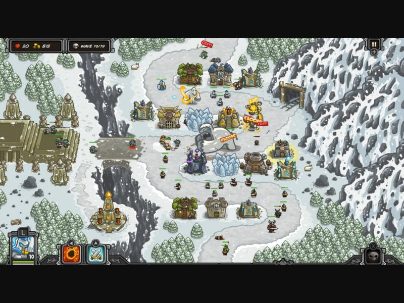
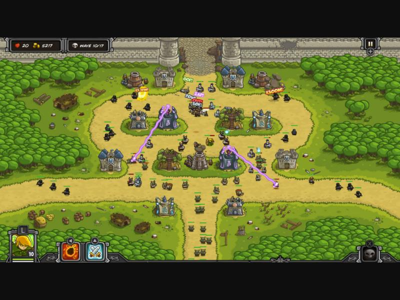
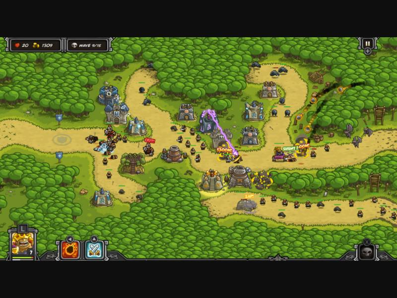
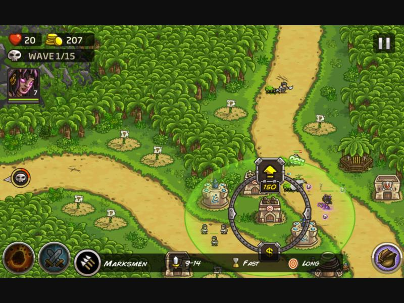
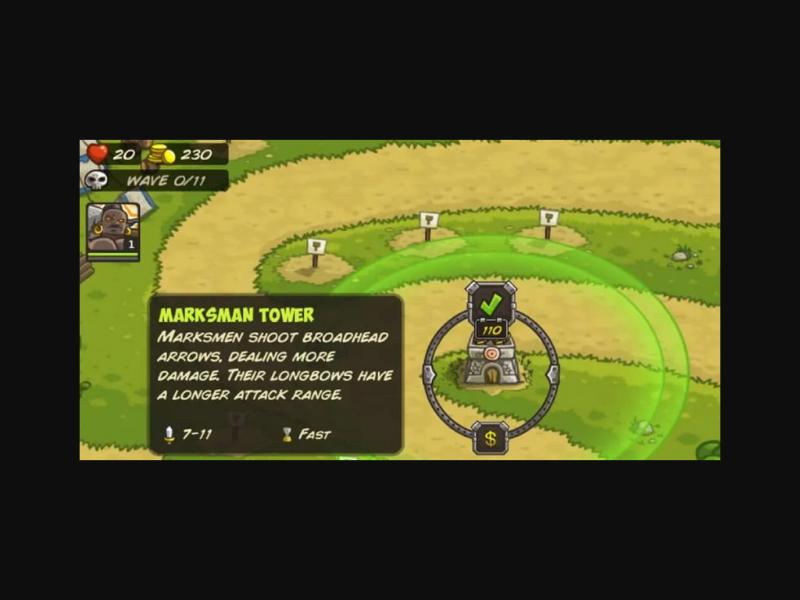
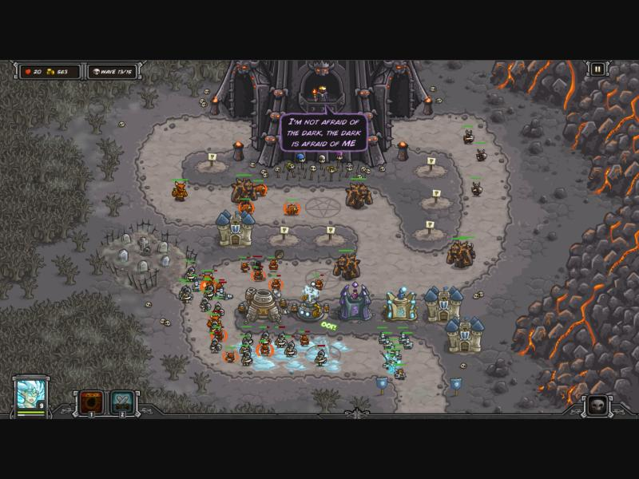
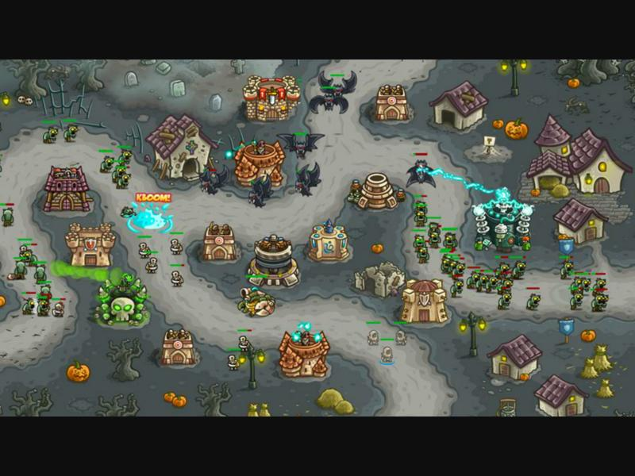

# Kingdom Rush 리서치 & 분석

> 목적: "4인 협동 + 영웅 직접 조종" 디펜스 게임을 만들기 전에, 원작 Kingdom Rush(이하 KR, Ironhide Game Studio)의
> **규칙·재화·플로우·레벨 디자인·시각 언어**를 정리하고, 협동 하이브리드 장르(Dungeon Defenders 등)와 비교해
> 우리 게임으로 옮길 때 무엇을 지키고 무엇을 바꿔야 하는지 도출한다.
> 참고 이미지: `docs/refs/` (출처는 문서 하단)

---

## 1. 게임 개요

| 항목 | 내용 |
|---|---|
| 개발 | Ironhide Game Studio (우루과이), 2011 플래시 → 모바일/PC |
| 시리즈 | KR(2011), Frontiers(2013), Origins(2014), Vengeance(2018), Alliance(2024), Genesis 등 |
| 장르 | 고정 경로(Path) 타워 디펜스 + 영웅 유닛 + 스펠 |
| 시점 | 위에서 비스듬히 내려다보는 2D 일러스트 맵(약 3/4 탑다운). 맵 전체가 한 화면에 들어옴 |
| 핵심 차별점 | **병영(Barracks)의 보병이 길을 막는 "블로킹"**, 영웅, 스펠, 정해진 건설 부지(Strategic Point) |

## 2. 코어 루프 & 플로우

```
[스테이지 시작: 시작 골드, 생명 20]
   → 건설 부지에 타워 건설
   → [해골 버튼] 웨이브 호출 (일찍 부르면 남은 초만큼 보너스 골드)
   → 적이 경로를 따라 진군 → 타워/병사/영웅/스펠로 처치 → 골드 획득
   → 업그레이드/추가 건설 → 다음 웨이브 ... (보통 10~20 웨이브)
   → 모든 웨이브 클리어 = 승리 (남은 생명에 따라 별 1~3개)
   → 출구 도달 적 1마리당 생명 -1 (보스·대형은 더 깎음), 생명 0 = 패배
```

### 2.1 재화와 수치 (KR1 기준, 커뮤니티 자료와 대표값)
| 요소 | 값 | 비고 |
|---|---|---|
| 생명 | 20 | 별: 18 이상 ★3, 6 이상 ★2, 그 외 ★1 (대략) |
| 시작 골드 | 스테이지별 220~1000 | 초반 타워 2~4개 분량 |
| 골드 획득 | 적 처치 바운티 | 고블린 3G, 오크 9G 내외, 보스 수백 G |
| 조기 호출 보너스 | **남은 초 = 보너스 골드**, 스펠 쿨다운도 같은 초만큼 감소 | 위험과 보상 결정 |
| 판매 | 투자액의 약 60% 환급 | 재배치 비용 = 손실 40% |
| 타워 1단계 비용 | 궁수 70 / 병영 70 / 마법사 100 / 대포 125 | |
| 업그레이드 | 궁수 110→160, 병영 110→150, 마법사 160→240, 대포 220→320 | 4단계는 2갈래 특화 (230~400) |

### 2.2 타워 4종
| 타워 | 역할 | 특징 |
|---|---|---|
| **궁수 (Archer)** | 단일 물리 DPS | 빠른 공속, 공중 공격 가능, 저렴 |
| **병영 (Barracks)** | 블로킹 | 병사 3명 소환, **집결 지점(Rally Point)** 지정, 죽으면 약 10초 뒤 재소환 |
| **마법사 (Mage)** | 마법 DPS | 방어력 무시(마법 저항에는 막힘), 공속 느림, 장갑 적 카운터 |
| **대포 (Artillery)** | 광역(스플래시) | 느린 포탄, 군집 처리, 공중 공격 불가, 장갑 50% 관통 |

### 2.3 적 설계 문법
| 적 | 특성 | 무엇을 가르치나 |
|---|---|---|
| 고블린 | HP 낮음, 빠름, 3G | 기본 |
| 오크 | 방어 30% | 업그레이드 필요 |
| 늑대(Wulf) | 매우 빠름, 근접 회피 | 병영 블로킹/궁수 |
| 샤먼 | 마법 저항 85%, 아군 치유 | 물리 버스트, 블로킹 우선순위 |
| 장갑 전사 | 방어 60~80% | 마법사 필요 |
| 비행 (박쥐 등) | 블로킹 무시, 대포 면역 | 궁수/마법사 필수 |
| 보스 | 거대 HP, 생명 다량 차감 | 총력 대응 |

→ **새 적은 한 번에 하나씩**, 기존 해법의 약점을 찌르는 형태로 등장 ("wake-up call").
→ 피해 타입은 **물리 / 마법 / 진(True)**, 적은 **방어력(Armor)·마법저항(MR)** 등급(없음, 낮음, 중간, 높음, 매우 높음)을 가진다.

### 2.4 영웅 (KR 원작)
- 맵 위 1명, **위치를 클릭으로 지정하면 이동**(직접 조작이 아닌 RTS식 명령).
- 적을 막고(블로킹) 근접/원거리 공격. 스테이지 내에서 경험치로 레벨업(최대 10), HP와 공격력이 오른다.
- 스킬 2~3개는 자동 발동. 사망 시 약 15~20초 뒤 부활.
- 스펠: **불비(Rain of Fire, 쿨 80초)**, **지원군(Reinforcements, 쿨 10초, 병사 2명 소환)**.

### 2.5 레벨 디자인 원칙 (Game Developer 분석 요약)
1. **정해진 건설 부지**로 초크포인트를 만든다. 아무 데나 지을 수 없다.
2. **다중 경로 스테이지**는 예산을 분산시킨다. 일부 부지만 두 길을 함께 커버한다.
3. 매 스테이지 **새 개념 1개**를 이전 지식 위에 쌓는다. 중간에 "숨 고르는" 스테이지를 둔다.
4. 병영 블로킹과 원거리 타워의 **필수 시너지**가 전략의 중심이다.
5. 수치 밸런스는 방어 30~95%, 병사 재소환 10초, 스펠 쿨 80초처럼 의도적 약점을 둔다.

---

## 3. 시각 분석





### 3.1 화면 구성
- **맵 전체가 한 화면**: 플레이어는 전장을 조망하며 탭으로 명령. HUD는 네 귀퉁이에 몰려 있다.
  - 좌상: ❤ 생명 / 💰 골드 / 💀 WAVE n/N
  - 좌하: 영웅 초상(레벨 숫자, HP 바), 스펠 2개(불비, 지원군)
  - 우하: 백과사전, 우상: 일시정지
- **길(Path)**은 밝은 베이지/모래색 굵은 띠로, 주변(잔디·숲·바위)보다 **명도가 가장 높아** 한눈에 읽힌다.
- **건설 부지**는 길 바로 옆의 작은 흙 원판 + 표지판(흰 깃발 팻말). 비어 있을 때 "여기 지을 수 있다"는 신호.
- 맵 가장자리는 빽빽한 숲·절벽·물로 막아 **경로 외 공간을 장식으로 채움**(클래시 미니와 같은 디오라마 원칙).

### 3.2 건설·업그레이드 UI (링 메뉴)



- 부지/타워를 누르면 그 자리에 **원형 링**이 열리고, 링 위 4방향에 아이콘 버튼이 붙는다.
  - 빈 부지: 4개 타워 아이콘 + 비용
  - 기존 타워: 위 = 업그레이드(비용), 아래 = **$ 판매**, 4단계에서는 좌우로 특화 선택
- 선택 시 아이콘이 ✔로 바뀌어 **두 번 눌러 확정**(오조작 방지). 하단에 툴팁(이름, 설명, 공격력, 공속, 사거리).
- 사거리는 **반투명 연두 원**으로 표시.

### 3.3 아트 스타일
- 2D 벡터 일러스트, **굵은 검은 외곽선 + 그라디언트 없는 3톤 셰이딩**(Ironhide 아티스트 언급).
- 질감은 패턴으로 표현: 잔디 = 뾰족한 가시 반복, 강철 = 넓은 회색 면.
- 유닛은 매우 작지만(화면 높이의 2~3%) **실루엣과 팀 색(아군 파랑/은색, 적 녹색·갈색)**으로 구분.
- 모든 유닛 머리 위에 **작은 녹색 HP 바**.
- 타격 연출: "KBOOM!", "POW!", "CRIT!" 같은 **만화 의성어 팝업**, 폭발은 노랑-주황 덩어리, 마법은 보라 번개.

### 3.4 컬러
| 요소 | 색 |
|---|---|
| 길 | 모래 베이지 `#E3C77F` ~ `#D9B866`, 가장자리 약간 어두운 띠 |
| 잔디 | 연두~초록 `#8DC63F`, 숲 `#4E9A2E` |
| 아군 타워 지붕 | 파랑 `#3F6FB5`, 석재 회색·베이지 |
| 마법 이펙트 | 보라 `#B05CFF`, 대포 폭발 노랑-주황 |
| UI 프레임 | 짙은 회색 금속 + 리벳, 노란 숫자 |

### 3.5 타워 비주얼 진화
- 단계가 오를수록 **크기·디테일·지붕 색·깃발**이 늘어 멀리서도 레벨이 읽힌다.
- 같은 종류는 실루엣이 일정하다: 궁수 = 목조 망루, 병영 = 문 달린 석조 막사, 마법사 = 보라 첨탑, 대포 = 둥근 포대.




---

## 4. 유사 장르: 협동 영웅 + 디펜스 하이브리드

| 게임 | 구조 | 시사점 |
|---|---|---|
| **Dungeon Defenders** (2011) | 4인 협동. **빌드 페이즈 → 컴뱃 페이즈**. 영웅이 직접 타워를 짓고 전투 중엔 직접 싸움. 마나는 처치·상자로 획득, 맵별 "방어 유닛" 상한 | 영웅 클래스마다 고유 타워 → 협동 필연성. 다만 빌드와 전투의 페이즈 분리로 템포가 끊긴다 |
| Orcs Must Die! | 3인칭 직접 전투 + 함정 설치, 2인 협동 | 액션 손맛과 함정 조합의 쾌감 |
| Sanctum | FPS + 미로 건설 | 직접 조준 사격과 타워의 공존 |

**결론**: 우리 게임은 *KR의 고정 경로, 정해진 부지, 4타워, 블로킹, 조기 호출 경제*와
*Dungeon Defenders의 4인 협동, 영웅 직접 조작, 영웅이 걸어가서 짓기*를 결합한다.
DD와 달리 **빌드와 전투를 분리하지 않고 실시간으로 섞어** KR 특유의 템포(웨이브 중에도 건설/업그레이드)를 유지한다.

---

## 5. 우리 게임으로의 번역 (설계 결정)

| KR 원작 | 4인 협동 + 직접 조작 버전 | 이유 |
|---|---|---|
| 한 화면 전체 맵 | **영웅을 따라가는 쿼터뷰 카메라** + **미니맵과 라인 위험도 패널** | 직접 조작은 근접 시점이 필요. 대신 다른 라인 상황 정보를 UI로 보충 |
| 탭으로 영웅 이동 명령 | **WASD 이동 + 마우스 조준 + 좌클릭 공격, Q/E 스킬** | 사용자 요청. 액션성 |
| 탭으로 부지 선택 → 링 메뉴 | **부지 근처에서 F → 링 메뉴(1~4 또는 클릭)** | 영웅이 물리적으로 가야 짓는다 → 라인 담당과 이동 판단이 생김 |
| 1개 경로 또는 소수 경로 | **4개 라인이 중앙 성으로 수렴, 플레이어마다 담당 라인 1개** | 사용자 요청. 각자 책임 + 지원 판단 |
| 골드 1개 지갑 | **팀 공용 골드** (KR과 동일한 바운티·조기 호출·판매 60%) | "재화는 KR과 동일" 요청. 공용이라 협동 구매 판단이 생김 |
| 생명 20 | **팀 공용 생명 20**, 출구는 중앙 성 | 한 라인이 무너지면 모두 진다 → 지원 동기 |
| 영웅 레벨업(스테이지 내) | 동일. 처치 경험치로 최대 Lv5, HP와 공격력 상승 | |
| 영웅 부활 15~20초 | **12초 뒤 중앙 성에서 부활** | 협동 템포 |
| 스펠(불비, 지원군) | 각 영웅의 **Q/E 스킬**로 흡수 (예: 마법사 Q = 운석, 기사 E = 함성 등) | 플레이어 개인 기술로 이전 |
| 조기 호출: 해골 탭 | **성의 웨이브 깃발에서 F** (또는 HUD 버튼) → 남은 초만큼 골드 | |
| 블로킹: 병사와 영웅 | 동일. 지상 적은 병사/영웅과 교전하면 멈춤, 비행은 무시 | KR 핵심 |
| 빈 라인 | **봇이 빈 자리를 채움** (솔로 = 1인 + 봇 3) | 언제든 4라인을 운영할 수 있게 |

### 5.1 협동을 만드는 장치
1. **라인 위험도**: 라인별 "출구까지 남은 거리 × 적 HP" 지표 → 색(초록/노랑/빨강)과 경고음, 미니맵 깜빡임.
2. **공용 골드**: 누가 어디에 투자할지가 자연스러운 협의 거리. 판매 60%로 재배치 비용이 있다.
3. **영웅 역할 분담**: 탱커, 원거리, 광역, 브루저, 서포트(힐). 서포트는 다른 라인 지원 시 가치가 극대화된다.
4. **중앙 수렴 맵**: 라인 끝이 성에서 만나므로, 성 주변은 최후 방어선으로 모두가 지나간다.

---

## 6. 출처
- [Wikipedia – Kingdom Rush](https://en.wikipedia.org/wiki/Kingdom_Rush)
- [Game Developer – Kingdom Rush: the wonderful campaign level design](https://www.gamedeveloper.com/design/kingdom-rush---the-wonderful-campaign-level-design)
- [Kingdom Rush Wiki – Heroes](https://kingdomrushtd.fandom.com/wiki/Heroes/Kingdom_Rush), [Armor and Magic resistance](https://kingdomrushtd.fandom.com/wiki/Armor_and_Magic_resistance), [Goblin](https://kingdomrushtd.fandom.com/wiki/Goblin), [Orc](https://kingdomrushtd.fandom.com/wiki/Orc), [Shaman](https://kingdomrushtd.fandom.com/wiki/Shaman), [DPS and COST of towers](https://kingdomrushtd.fandom.com/wiki/DPS_and_COST_of_towers)
- [wikily.gg – Spells](https://wikily.gg/kingdom-rush/spells), [Hushwood waves](https://wikily.gg/kingdom-rush/stages/hushwood)
- [Steam Guide – KR 1~4 Complete Overview](https://steamcommunity.com/sharedfiles/filedetails/?id=2890854062), [Towers and Units Guide](https://steamcommunity.com/sharedfiles/filedetails/?id=2812921847)
- [Steam Discussions – Call waves early](https://steamcommunity.com/app/246420/discussions/0/630800446998172077/)
- [Ironhide Forum – Art style](https://forums.ironhidegames.com/viewtopic.php?f=5&t=158), [SlideShare – Kingdom Rush Behind the Scenes](https://www.slideshare.net/slideshow/kingdom-rush-behind-the-scenes/11930274)
- [Wikipedia – Dungeon Defenders](https://en.wikipedia.org/wiki/Dungeon_Defenders), [Dungeon Defenders Wiki – Campaign](https://dungeondefenders.wiki.gg/wiki/Campaign)
- 이미지: Steam 스토어 스크린샷(KR, Frontiers), addictedgamewise.com(ref 05), Pocket Gamer(ref 08), Steam 커뮤니티 가이드(ref 07, 09)

> 수치는 커뮤니티 위키와 가이드의 대표값으로, 시리즈와 버전에 따라 다르다. 참고 이미지 저작권은 Ironhide Game Studio에 있다.
