# 기획서 — TOY RUSH (가제)
### 4인 협동 · 영웅 직접 조종 · 킹덤러시식 라인 디펜스

| 항목 | 내용 |
|---|---|
| 문서 버전 | v0.1 (프로토타입 기준) |
| 엔진 | Godot 4.7 (GDScript, Forward+) |
| 플랫폼 | PC 프로토타입 (16:9, 키보드+마우스), 모바일 확장 전제 |
| 인원 | 1~4인 협동 (LAN 호스트/참가). 빈 자리는 봇 영웅이 채움 |
| 레퍼런스 | Kingdom Rush ([리서치](01_리서치_킹덤러시_분석.md)), Dungeon Defenders, TOY CLASH(비주얼 자산) |
| 비주얼 | TOY CLASH의 장난감 디오라마 스타일 계승 (데포르메 피규어, 둥근 소품, 고채도, 쫄깃한 모션, 만화풍 VFX) |

---

## 0. 한 줄 요약
> 4방향에서 몰려오는 몬스터 웨이브를, 네 명의 영웅이 **각자 담당 라인에서 직접 싸우고, 걸어가서 타워를 지으며**,
> 위태로운 라인은 서로 달려가 도와 막아내는 장난감 왕국 디펜스.

## 1. 디자인 필러
1. **내 라인은 내가 지킨다**: 담당 라인이 있어 책임과 소유감이 생긴다.
2. **도와주러 달려가는 순간**: 라인 위험도 UI와 지원 이동이 협동의 클라이맥스.
3. **킹덤러시의 단단한 뼈대**: 고정 경로, 건설 부지, 4타워, 블로킹, 조기 호출, 판매 60%, 생명 20.
4. **손맛 있는 영웅 액션**: WASD, 마우스 조준, Q/E 스킬, 히트스톱, 셰이크, 만화 VFX.

## 2. 조작
| 입력 | 동작 |
|---|---|
| W A S D | 이동 (카메라 기준 방향) |
| 마우스 | 조준 (지면에 조준 링 표시) |
| 좌클릭 (누르고 있기) | 기본 공격 (자동 반복) |
| Q / E | 스킬 1 / 스킬 2 |
| F | 상호작용: 빈 부지 = 건설 링 메뉴, 타워 = 업그레이드/판매, 성의 뿔나팔 = 웨이브 조기 호출 |
| 1 ~ 4 / 클릭 | 링 메뉴 항목 선택 (한 번 더 누르면 확정) |
| Tab (누르고 있기) | 전체 맵 보기 |
| 휠 | 줌 |
| Esc | 메뉴 닫기 / 일시 메뉴 |

## 3. 게임 플로우
```
타이틀 → [솔로(봇 3) | LAN 호스트 | LAN 참가]
      → 로비: 슬롯 4개, 각자 영웅 선택(중복 불가), 빈 슬롯은 봇
      → 스테이지 시작 (준비 시간 30초, 골드 500, 생명 20)
      → 웨이브 1~10 (웨이브 사이 25초 카운트다운, 조기 호출 가능)
      → 승리: 웨이브 10(보스) 클리어 → 별 평가
      → 패배: 생명 0
```
- **담당 라인**: 슬롯 1~4가 북/동/남/서 라인을 맡는다. 시작 시 영웅은 자기 라인 앞에 선다.
- 웨이브 시작 시 4개 라인에서 동시에 적이 출발한다(라인별 구성은 다르게).

## 4. 재화와 경제 (킹덤러시 동일 규칙)
| 항목 | 값 |
|---|---|
| 팀 공용 골드 | 시작 500 (4라인 × 125, 라인당 첫 타워 1~2개 분량) |
| 바운티 | 적 처치 시 공용 골드 + (화면에 코인 팝업) |
| 조기 호출 | 남은 초 × 1 G 보너스, 모든 영웅 스킬 쿨다운도 남은 초만큼 감소 (최대 10초) |
| 판매 | 투자 총액의 60% 환급 |
| 팀 공용 생명 | 20. 일반 적 1, 장갑 전사 2, 보스 5 차감 |
| 별 | 생명 18 이상 ★3, 10 이상 ★2, 그 외 ★1 |

## 5. 타워 (4종 × 3단계)
| 타워 | Lv1 / Lv2 / Lv3 비용 | 성능 (Lv1→Lv3) | 특성 |
|---|---|---|---|
| 궁수탑 | 70 / 110 / 160 | 물리 5→13, 0.8→0.6초, 사거리 6.5→7.5 | 공중 가능, 가장 앞선 적 우선 |
| 병영 | 70 / 110 / 150 | 병사 3명 HP 50→120, 공격 3→8, 방어 0→30% | 블로킹, 사망 시 10초 뒤 재소환, 집결 지점 자동(가장 가까운 길) |
| 마법탑 | 100 / 160 / 240 | 마법 12→36, 1.5→1.3초, 사거리 6→7 | 방어 무시, 공중 가능 |
| 대포 | 125 / 220 / 320 | 물리 10→30, 범위 1.6→2.0, 3.0→2.6초 | 광역, 방어 50% 관통, 지상만 |

- 건설 부지: 라인마다 6개 (길 양옆).
- 건설 시 장난감 낙하 연출(쿵, 스쿼시, 먼지 링). 업그레이드 시 빛기둥과 크기·디테일 증가.

## 6. 적 (7종)
| 적 | HP | 속도 | 방어 | 마저 | 바운티 | 생명 | 특징 |
|---|---|---|---|---|---|---|---|
| 고블린 | 20 | 2.6 | 0 | 0 | 3 | 1 | 기본 |
| 오크 | 60 | 1.8 | 30% | 0 | 8 | 1 | 경장갑 |
| 늑대 | 35 | 4.0 | 0 | 0 | 6 | 1 | 매우 빠름 |
| 샤먼 | 45 | 1.8 | 0 | 85% | 10 | 1 | 주변 아군 치유 |
| 박쥐 | 40 | 2.8 | 0 | 0 | 7 | 1 | **비행**: 블로킹 무시, 대포 면역 |
| 흑기사 | 150 | 1.4 | 70% | 0 | 18 | 2 | 중장갑 (마법탑이 카운터) |
| 오우거 (보스) | 1500 | 1.0 | 20% | 20% | 200 | 5 | 웨이브 10, 광역 내려찍기 |

- **블로킹**: 지상 적은 병사나 영웅에게 붙잡히면 멈추고 싸운다. 영웅은 동시에 3마리까지 붙잡는다.
- 웨이브가 진행될수록 적 HP +5%/웨이브. 3웨이브부터 라인별 추가 그룹(북 고블린, 동 늑대, 남 오크, 서 박쥐).
- 영웅의 근접 공격은 비행 적도 맞힌다(병사는 불가).

## 7. 영웅 5종
공통: 사망 시 12초 뒤 중앙 성에서 부활. 처치 경험치(바운티 × 3, 주변 영웅은 × 1 공유)로 Lv1~5 (필요 XP 150/380/700/1100, 레벨당 HP·공격 +12%).

| 영웅 | 역할 | HP | 기본 공격 (좌클릭) | Q | E |
|---|---|---|---|---|---|
| **킹** | 탱커 | 320 | 대검 부채꼴 베기 (근접 14) | **그라운드 슬램**: 주변 r3 40 피해 + 1.5초 기절 (쿨 9) | **전투 함성**: 주변 적이 자신을 노리게 하고 4초간 받는 피해 -50% (쿨 14) |
| **퀸** | 원거리 딜러 | 180 | 화살 (사거리 9, 12, 빠름) | **부채 연사**: 조준 방향 7발 (쿨 7) | **구르기**: 이동 방향 대시, 다음 3발 강화 (쿨 6) |
| **위자드** | 광역 마법 | 160 | 파이어볼 (마법 16, 범위 1.5) | **운석**: 조준점에 0.8초 뒤 r3.5 90 마법 피해 (쿨 12) | **블링크**: 조준점으로 순간이동 + 소폭발 (쿨 8) |
| **발키리** | 브루저 | 270 | 도끼 회전 베기 (주변 r1.9, 10) | **회오리**: 2.5초간 회전하며 이동, 0.25초마다 8 (쿨 12) | **도약 강타**: 조준점으로 도약, 착지 r2.5 35 + 넉백 (쿨 9) |
| **클레릭** | 서포트 | 190 | 성광탄 (마법 15, 사거리 8.5) | **치유의 빛**: 주변 r5 영웅과 병사 즉시 40 + 3초간 40 회복 (쿨 14) | **성역**: 조준점 r3.5에 5초 결계, 적 50% 감속 + 초당 6 (쿨 12) |

## 8. 협동 장치
- **라인 위험도 패널**(좌측): 라인별 담당자 색, 적 수, 위험도 게이지(출구까지 남은 거리 × HP). 위험하면 깜빡임과 경고음.
- **미니맵**(우상단): 라인, 적(빨강 점), 영웅(플레이어 색 점), 타워.
- **핑**: 위험 라인이 빨강이 되면 화면 가장자리에 방향 화살표.
- **봇 영웅**: 담당 라인 전선 근처에서 싸우고, 공용 골드가 여유 있으면 자기 라인 부지에 건설하고 업그레이드한다. 자기 라인이 한가하고 다른 라인 위험도가 높으면 지원하러 이동한다.

## 9. 맵: "장난감 왕국 사거리"
- 중앙에 장난감 성(출구). 북·동·남·서 가장자리 동굴에서 각 라인이 구불구불 성으로 수렴한다.
- 4개 라인은 같은 형태를 90°씩 회전시켜 공정성을 맞춘다. 라인 길이는 약 45 유닛.
- 디오라마 장식: 박스형 잔디 블록, 브로콜리 나무, 바위, 통, 꽃, 연못.
- 플레이어 색 (P1 파랑, P2 빨강, P3 초록, P4 노랑)의 깃발로 라인 소유를 표시한다.

## 10. 카메라와 UI
- **쿼터뷰**: 요(yaw) 45°, 피치 약 55°의 원근 카메라가 내 영웅을 부드럽게 추적. 휠 줌, Tab 전체 보기.
- 상단 좌: ❤ 생명 / 💰 골드 / 💀 웨이브 n/10 / 다음 웨이브 카운트다운.
- 하단 중앙: 영웅 초상, 레벨, HP·XP 바, Q/E 아이콘과 쿨다운 스윕.
- 링 메뉴: 부지 위 월드 공간 원형 링 + 4방향 버튼(아이콘, 비용, 단축키), 사거리 원 미리보기.
- 만화 의성어 팝업 (POW, KBOOM), 코인 팝업, 데미지 숫자.

## 11. 기술 설계
**호스트 권한형(Host-authoritative) 구조, 시뮬레이션(Sim)과 화면(View) 분리**
```
Sim (호스트에서만 실행, 순수 로직)          View (모든 피어, 노드 기반 렌더)
  heroes / enemies / soldiers / towers  ──스냅샷(20Hz)──▶  엔티티 보간, 모델, HP 바
  waves / economy / lives               ──이벤트(즉시)──▶  VFX, 사운드, 팝업
        ▲                                                   │
        └──────── 입력(이동, 조준, 버튼, 건설 요청) ─────────┘
```
- 솔로 플레이도 같은 경로(로컬 호스트)를 쓴다. 네트워크 코드와 싱글 코드가 갈라지지 않는다.
- 네트워크: Godot ENet (포트 7777), RPC로 로비 동기화, 입력 전송(비신뢰), 스냅샷(비신뢰, 패킹 배열), 이벤트·요청(신뢰).
- 봇은 사람과 같은 입력 구조체를 생성하는 컨트롤러다.

```
toy_rush/scripts/
  main.gd        흐름 (타이틀 → 로비 → 게임 → 결과)
  net.gd         ENet 호스트/참가, RPC, 스냅샷/이벤트/입력 전송
  data.gd        영웅, 적, 타워, 웨이브 데이터
  map_def.gd     라인 경로, 부지, 성, 스폰 (90° 회전 대칭)
  sim.gd         시뮬레이션 (엔티티, 전투, 웨이브, 경제)
  bot.gd         봇 영웅 컨트롤러
  view.gd        월드 렌더 (맵 빌드, 엔티티 동기화, 이벤트 → VFX)
  hud.gd         HUD, 링 메뉴, 미니맵, 라인 패널
  lobby.gd       타이틀, 로비, 영웅 선택 UI
  (재사용) unit_model.gd, vfx.gd, mats.gd, sfx.gd, camera_rig.gd
```

## 12. 우선순위
| 우선순위 | 기능 | 프로토타입 |
|---|---|---|
| P0 | 쿼터뷰 맵 4라인, 웨이브 10, 적 7종, 경로 이동, 생명 | ✅ |
| P0 | 영웅 직접 조작 (WASD, 마우스, 공격, Q/E), 영웅 5종 | ✅ |
| P0 | 건설 부지, F 링 메뉴, 타워 4종 3단계, 판매, 공용 골드, 조기 호출 | ✅ |
| P0 | 블로킹(병사, 영웅), 피해 타입(물리/마법), 방어/마저 | ✅ |
| P1 | 봇 영웅 (라인 방어, 건설, 지원), 라인 위험도, 미니맵 | ✅ |
| P1 | LAN 4인 협동 (호스트/참가, 로비, 영웅 선택) | ✅ |
| P1 | 영웅 레벨업, 부활, 별 평가, VFX와 사운드 | ✅ |
| P2 | 4단계 특화 타워, 집결 지점 수동 지정, 스테이지 다수, 핑 시스템 | ⏳ |
| P3 | 온라인 매치메이킹, 모바일 가상 스틱, 메타 성장 | ⏳ |


---

## 13. 프로토타입 구현 결과 (M0)

| 타이틀 | 로비 (영웅 선택) |
|---|---|
| 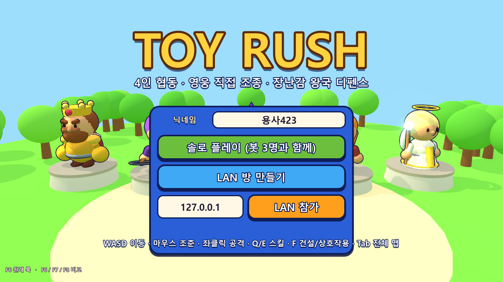 | 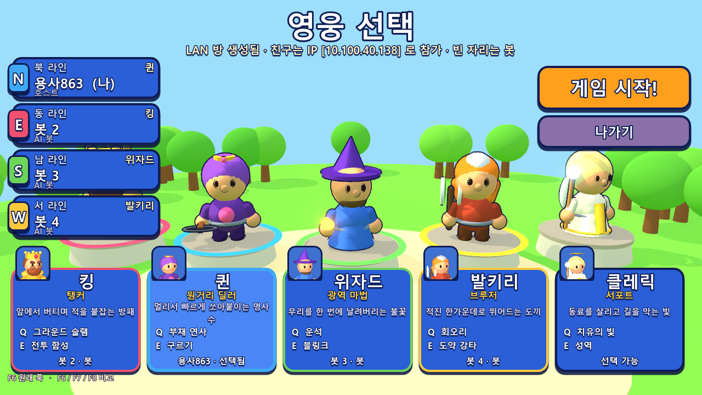 |
| **전체 맵 (Tab)** | **링 메뉴: 건설 선택 + 툴팁 + 사거리** |
| 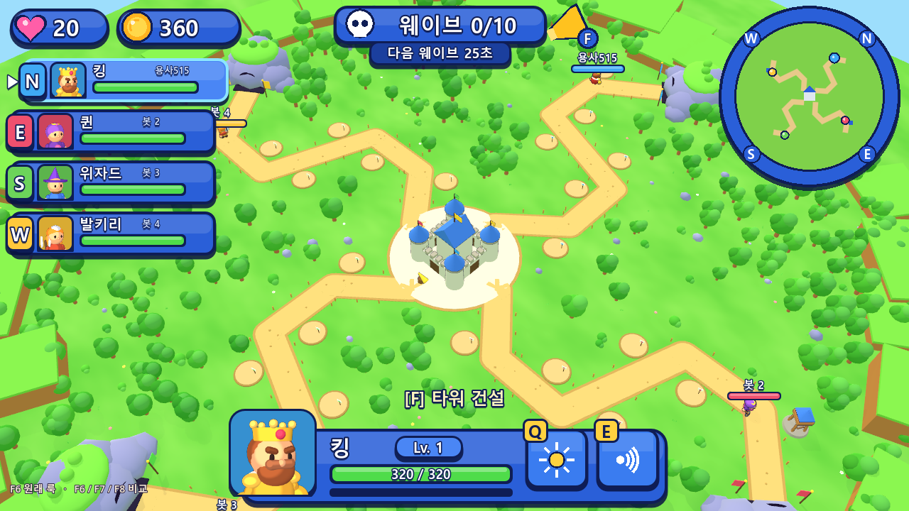 | 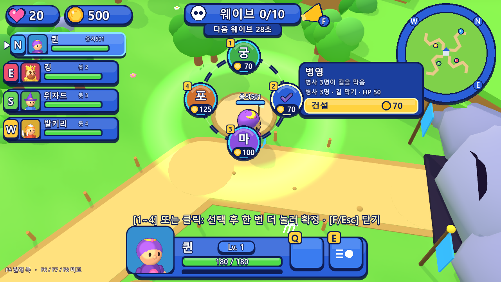 |
| **업그레이드/판매** | **보스 웨이브, 부활 대기, 위험 라인 화살표** |
| 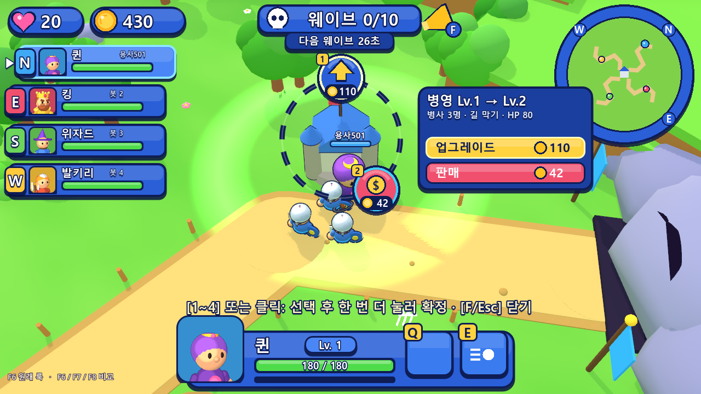 | 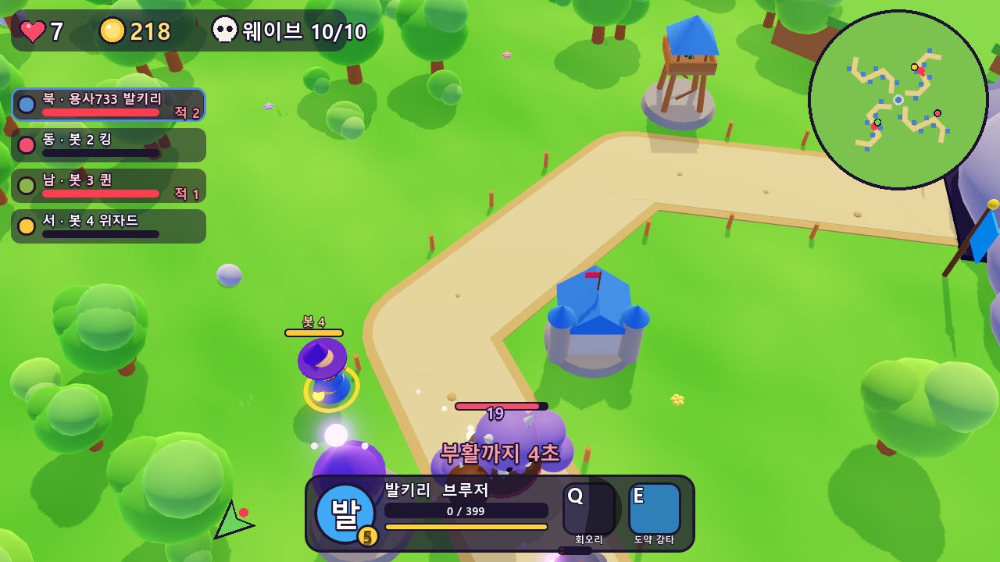 |
| **승리 결과 (별, 통계)** | **LAN: 호스트(킹, 북) / 클라이언트(퀸, 동)** |
| 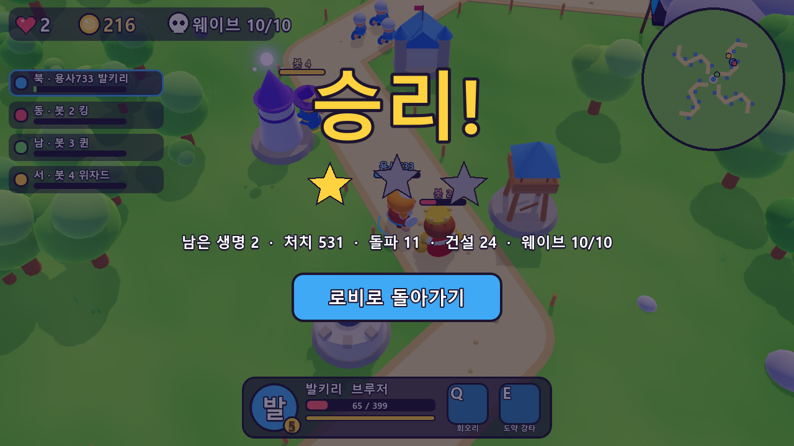 | 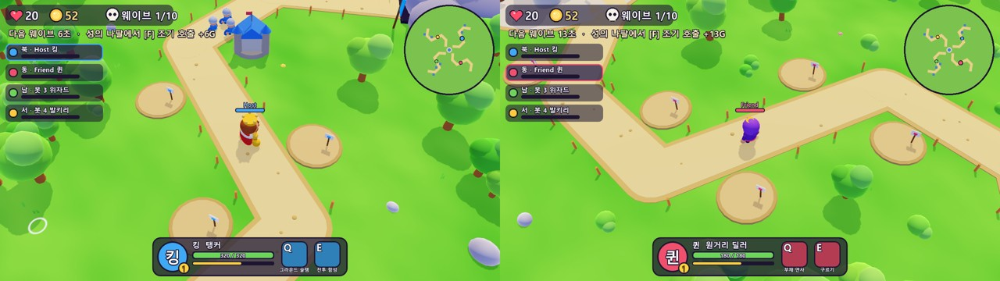 |

영웅 5종 스킬 시연(위에서부터 킹, 퀸, 위자드, 발키리, 클레릭):
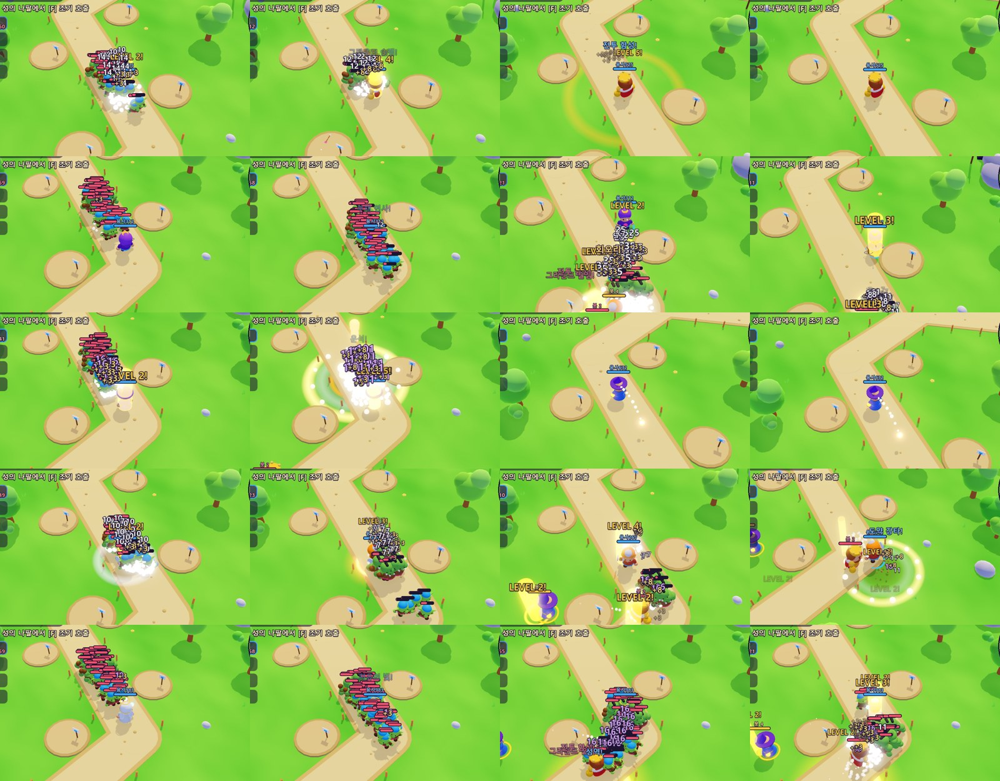

### 13.1 검증 내역
| 항목 | 방법 | 결과 |
|---|---|---|
| 밸런스 | `tests/sim_test.gd` 헤드리스, 봇 4명 × 영웅 조합 4종, 10웨이브 완주 | 봇만으로 대부분 승리(남은 생명 2~13), 가끔 패배. 사람이 섞이면 협동 판단이 승패를 가름 |
| 건설 UI | `--uitest`: 실제 키 이벤트로 F → 2 → 2(확정) → F → 1 → 1 → 나팔 F | 메뉴 4항목, 병영 건설(500→430G), Lv2 업그레이드, 웨이브 호출 성공 |
| 스킬 | `--skilltest` 영웅별 공격, Q, E | 5종 모두 판정과 VFX 정상 |
| 전체 판 | `--solo --autoplay --speed=3` | 웨이브 10 보스까지 진행, 승리 화면 확인 |
| LAN | 같은 PC에서 호스트와 클라이언트 2개 인스턴스 | 접속, 로비 동기화, 자동 시작, 공용 골드 동기화, 클라이언트의 웨이브 호출·건설 요청이 호스트에서 승인됨 |
| 네트워크 대역 | 스냅샷 int16 양자화 + DEFLATE 압축 | MTU 초과 경고 해소 |

### 13.2 리서치 → 구현 매핑
| 킹덤러시 / 리서치 | TOY RUSH 구현 |
|---|---|
| 정해진 건설 부지 + 표지판 | 라인당 6개 흙 원판 + 플레이어 색 팻말, 길 양옆 자동 배치 |
| 링 메뉴 + ✔ 두 번 눌러 확정 + 툴팁 + 사거리 원 | 동일 (월드 위치 추적 2D 링, 1~4 키 지원) |
| 타워 단계별 크기·지붕·깃발 증가 | `tower_model.gd`: Lv별 높이, 지붕 색, 깃발, 포신 수, 마법 구슬 수 |
| 병영 병사 블로킹, 10초 재소환 | 병사 3명, 집결 지점 = 가장 가까운 길, 블로킹 시 적 정지 |
| 조기 호출 = 남은 초만큼 골드 + 스펠 쿨 감소 | 성의 나팔에서 F: 남은 초 = 골드, 전원 스킬 쿨 감소(최대 10초) |
| 판매 60% | 동일 |
| 길이 가장 밝은 명도 | 모래색 길 + 진한 테두리, 잔디는 노이즈 텍스처 |
| 숲과 절벽으로 맵 외곽 장식 | MultiMesh 숲 벨트와 수풀 약 480그루, 박스형 지형 블록, 바위 동굴 스폰 |
| 만화 의성어와 코인 팝업 | 데미지 숫자, +골드 팝업, 스킬명 콜아웃, WAVE/BOSS 배너 |

### 13.3 알려진 한계와 다음 단계
- 네트워크는 LAN 직접 접속만 지원. 온라인은 릴레이나 매치메이킹 서버가 필요(P3).
- 클라이언트 화면은 호스트 스냅샷을 20Hz로 보간하므로 클라이언트의 내 영웅 이동에 약간의 지연이 있음. 다음 단계는 클라이언트 측 이동 예측.
- 타워 4단계 특화, 병영 집결 지점 수동 지정, 핑 시스템, 스테이지 추가는 P2.
- 모델은 프리미티브 조합이라 실루엣 디테일에 한계가 있음. glTF 에셋 교체 파이프라인을 계획.


---

## 14. 브롤스타즈풍 카툰 셰이딩 (v0.2)

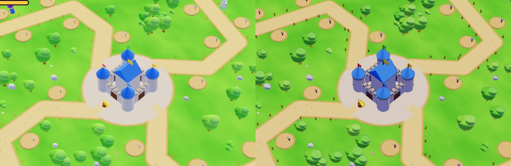
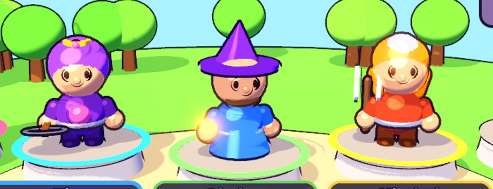
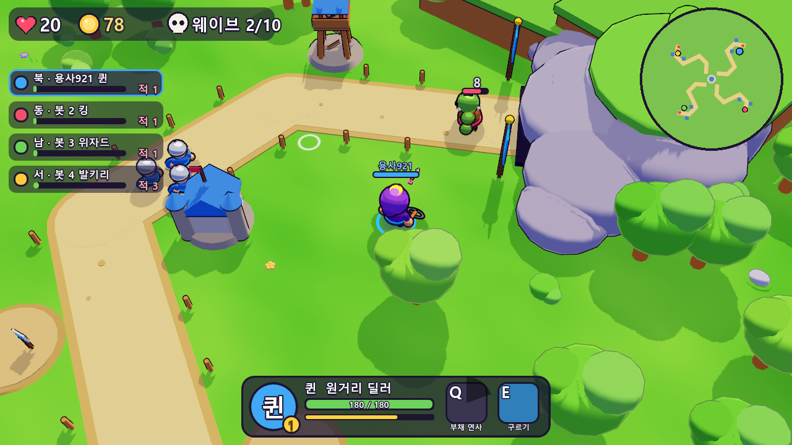

### 14.1 브롤스타즈 셰이딩 분석
| 특징 | 설명 |
|---|---|
| 2톤 셀 셰이딩 | 명부와 암부가 **날카로운 경계**로 나뉘고, 중간 그라디언트가 거의 없다 |
| 잉크 외곽선 | 캐릭터에 진하고 일정한 두께의 외곽선. 순검정이 아니라 **바탕색을 어둡게 한 보라 계열** |
| 컬러 섀도 | 암부는 회색이 아니라 **차갑고 채도 있는 톤**(푸른 보라 쪽으로 이동) |
| 하드 스페큘러 | 둥근 표면(머리, 헬멧)에 작고 선명한 하이라이트 덩어리 |
| 림 라이트 | 실루엣 가장자리에 얇은 밝은 띠 |
| 환경 | 평면적인 고채도 색, AO 최소, 벽과 덤불도 진한 테두리로 읽힘 |

### 14.2 구현
| 요소 | 방법 |
|---|---|
| 셀 셰이딩 | `StandardMaterial3D` 의 `DIFFUSE_TOON` + 낮은 roughness(0.1~0.18)로 하드 터미네이터 (`Mats.toonify`) |
| 외곽선 | `scripts/outline.gdshader`: 인버티드 헐을 **화면 공간에서 픽셀 단위로 밀어내** 거리와 관계없이 일정한 두께. 모든 머티리얼의 `next_pass` |
| 외곽선 색 | `Mats.ink()`: 바탕색 72% 어둡게 + 남보라 `#1d1035` 45% 혼합. MultiMesh(나무, 바위)는 인스턴스 색에서 계산 |
| 두께 | 캐릭터 3.0px, 소품 2.0px, 나무 1.8px, 길·부지·풀잎 0 (해상도 720p 기준, 화면 높이에 비례) |
| 줌 대응 | 전역 셰이더 파라미터 `outline_scale` 을 카메라 거리로 갱신 (Tab 전체 맵에서 선이 뭉치지 않게 0.4배까지) |
| 스페큘러 | 캐릭터만 `SPECULAR_TOON`(작은 하드 하이라이트), 환경은 끔 (길이 하얗게 번쩍이는 문제 방지) |
| 조명 | 보조광 제거(이중 터미네이터 방지), 태양 1.0, 앰비언트 `#a3a8ff`(암부를 푸른 보라로), SSAO 약하게, 그림자 블러 축소, 블룸 임계값 1.5 |
| 연기 퍼프 | 툰 디퓨즈로 만화 구름처럼 |


---

## 15. 레퍼런스 톤 매칭 — 밝은 모바일 키아트 스타일 (v0.3)

| 레퍼런스 | 적용 결과 |
|---|---|
| 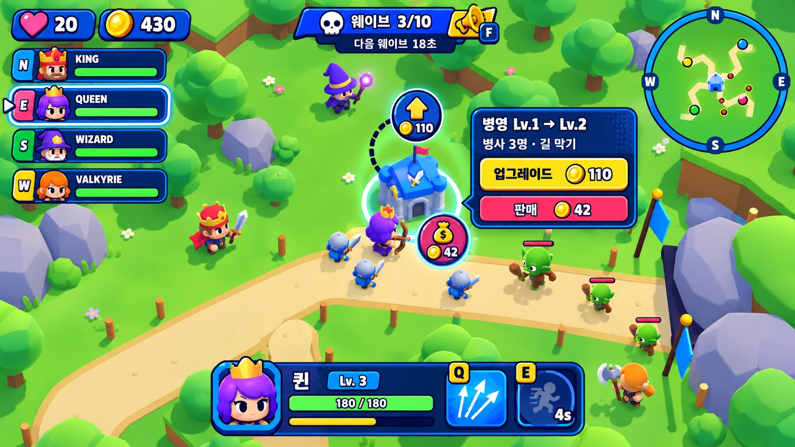 | 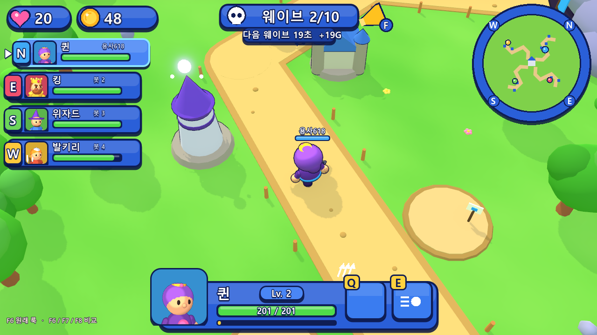 |
| **업그레이드/판매 카드** | **전체 맵** |
|  |  |

### 15.1 레퍼런스 분석
| 항목 | 관찰 |
|---|---|
| 조명 | 하이키(밝음). 화면 좌상단에서 오는 따뜻한 흰 태양, 그림자는 우하단으로 부드럽게. 하늘과 잔디의 반사광으로 암부도 밝다 |
| 셰이딩 | 캐릭터는 부드러운 셀(경계가 넓고 부드러움) + 얇은 남색 외곽선. 나무·바위·땅은 외곽선 없이 부드러운 음영 |
| 나무 | 위는 밝은 라임, 아래는 짙은 녹색으로 확실한 볼륨 |
| 바위 | 각진 로우폴리, 라벤더 회색 |
| 색 | 채도 높은 라임 잔디, 따뜻한 모래 길, 낮은 대비, 어두운 영역이 거의 없음 |
| UI | 로열 블루 패널 + 두꺼운 남색 테두리 + 하드 드롭섀도 + 상단 광택, 노란 강조, 영웅 초상화, 나침반 미니맵, 키 배지가 달린 Q/E 타일, 노란 업그레이드·빨간 판매 바 |

### 15.2 구현
| 항목 | 방법 |
|---|---|
| 공용 룩 | `scripts/look.gd`: 환경과 태양을 게임 맵과 로비가 공유 |
| 반구 앰비언트 | 앰비언트 소스를 Sky로 (위: `#cfeaff` 하늘, 아래: `#8ccf5a` 잔디 반사) → 윗면은 밝고 아랫면은 녹색 |
| 톤매핑 | 모바일 스타일처럼 **Linear** (Filmic의 채도 손실 제거), 글로우는 발광체만(임계 2.2) |
| 노출 보정 | 레퍼런스 픽셀 값을 직접 측정해 비교·보정. 잔디 (118,219,72) vs 레퍼런스 (131,217,64) |
| 태양 | `#fff4dc`, 화면 좌상단 방향, 그림자 불투명도 0.68, 블러 1.4 |
| 캐릭터 | 툰 디퓨즈 roughness 0.42(부드러운 셀) + 작은 하이라이트 + 따뜻한 림, 외곽선 1.9px 남색 계열 |
| 월드 | Burley 디퓨즈, 스페큘러 없음, 외곽선 없음 (타워·성은 1.3~1.4px 얇은 선) |
| 바위 | `SurfaceTool` 로 법선을 분리한 각진 로우폴리 메쉬 (`Look.rock_mesh`) |
| 카메라 | 거리 21 → 17 (캐릭터가 더 크게 보이도록) |
| UI | `hud.gd` 전면 개편: 블루 패널 시스템(`blue_box`, `gloss`), `Portraits`(SubViewport로 3D 영웅 얼굴 렌더), 웨이브 배너와 나팔 F 버튼, 나침반 미니맵, Q/E 픽토그램 아이콘, 업그레이드 카드 |


---

## 16. 스페이스바 이동기 + OCTOPO식 VFX (v0.4)

### 16.1 스킬 구조: Q / E / SPACE
모든 영웅이 스킬 3개를 갖는다. **이동기는 모두 SPACE**로 통일했다.

| 영웅 | Q | E | SPACE (이동기) |
|---|---|---|---|
| 킹 | 그라운드 슬램 (광역 기절) | 전투 함성 (도발 + 피해 감소) | **방패 돌진** (신규): 7m 돌진, 부딪힌 적 18 피해 + 0.5초 기절 + 밀쳐냄, 쿨 7 |
| 퀸 | 부채 연사 | **관통 화살** (신규): 12m 직선 위 모든 적 45 피해, 쿨 8 | **구르기** (E에서 이동): 쿨 5 |
| 위자드 | 운석 | **화염 폭발** (신규): 주변 r3.2 마법 35 + 2.5초 50% 감속 + 밀쳐냄, 쿨 9 | **블링크** (E에서 이동): 쿨 7 |
| 발키리 | 회오리 | **도끼 투척** (신규): 9m 날아갔다 돌아오며 왕복 각각 26 피해, 쿨 7 | **도약 강타** (E에서 이동): 쿨 8 |
| 클레릭 | 치유의 빛 | 성역 | **빛의 질주** (신규): 6m 질주, 체력 25 회복, 짧은 무적, 쿨 6 |

- 이동기 사용 중에는 붙잡혀 있던 적에게서 풀려난다(퀸, 위자드, 발키리, 클레릭, 킹).
- 네트워크 입력에 `sp` 시퀀스 카운터를 추가했고, 스냅샷 16번 칸에 SPACE 쿨다운 비율을 담는다. 봇도 상황에 맞춰 SPACE를 쓴다.
- 밸런스 재검증(봇 4명 × 영웅 조합 4종): 모두 승리, 남은 생명 10~20.

### 16.2 OCTOPO VFX 스튜디오 문법 (Clash Mini 외주 VFX 컨셉 시트 분석)
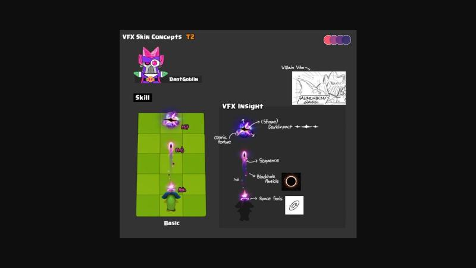

| 원칙 | 내용 |
|---|---|
| 기본 공격 3단 | **Atk**(발사 섬광) → **Proj**(시퀀스 트레일) → **Hit**(약 5프레임 임팩트) |
| 스킬 3단 | **예비동작**(에너지 흡수: 입자가 중심으로 모임) → **방출**(백열 코어 + 바늘 스파이크 + 링 충격파) → **잔상**(파편, 바닥 장판: 균열·룬·서리·그을음) |
| 팔레트 | 스킬마다 3색 견본(주색/보조/하이라이트). 코어는 흰색 과노출, 가장자리는 채도 |
| 형태 | 덩어리감 있는 그래픽 셰이프: 투톤 구름, 바늘형 별, 초승달 베기, 지그재그 번개 |
| 타이밍 | 방출 순간 1~2프레임이 가장 크고 빠르게 줄어듦 (EXPO ease) |

### 16.3 구현 (`scripts/octo.gd`)
| 함수 | 역할 |
|---|---|
| `impact` | Hit 5프레임: f1 흰 코어 → f2 바늘 스파이크 → f3 링 → 스파크 + 투톤 퍼프 |
| `muzzle` | Atk: 스파이크 섬광 + 진행 방향 스트릭 3줄 |
| `slash` | 초승달 베기 메쉬(중앙이 두껍고 끝이 가는 붓질 형태, 흰 안쪽 → 팔레트 바깥), 스윕 회전 |
| `charge` | 예비동작: 링에서 중심으로 빨려드는 별 입자 + 커지는 코어 |
| `burst` | 방출: 백열 코어, 회전 스파이크, 이중 링, 투톤 퍼프, 별 스파크, 셰이크 |
| `decal` | 바닥 장판: `crack`(균열) / `rune`(마법진) / `blob`(그을음) — 절차 텍스처 |
| `streak`, `lightning`, `dash_trail` | 빔, 지그재그 번개, 속도선과 먼지 |
| `flame_ring`, `shards`, `plus_rise` | 불꽃 고리, 땅에서 솟는 크리스털, 떠오르는 회복 십자 |
| `stun_stars`, `death`, `level_up`, `axe` | 기절 별, 영혼 위습이 있는 사망, 룬 + 기둥 레벨업, 회전하며 돌아오는 도끼 |

적용 범위: 영웅 기본 공격 5종, 스킬 15종, 타워 4종(마법탑 타격은 번개), 병사와 적의 근접 공격, 투사체(화살 스트릭, 파이어볼 불꽃 혀, 마법·신성탄 공전 스파클, 포탄 회전), 피격, 사망, 기절, 건설·업그레이드·판매, 회복, 레벨업, 부활, 조기 호출, 돌파 경고.

| 킹 | 퀸 |
|---|---|
| 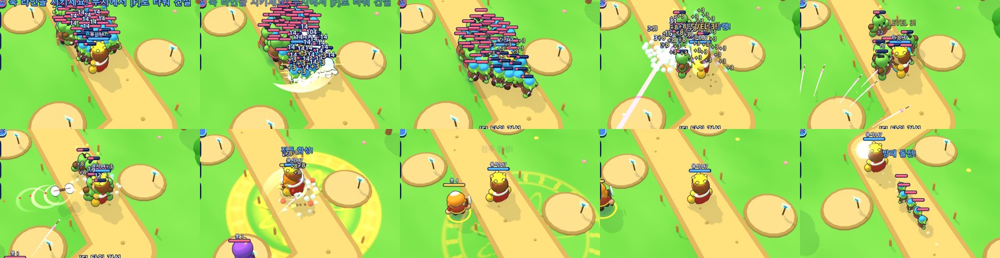 | 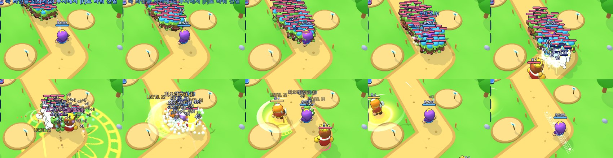 |
| **위자드** | **발키리** |
| 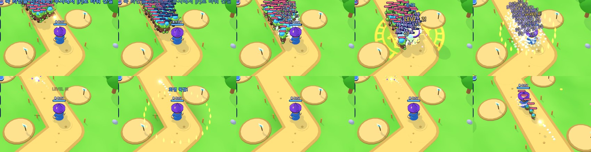 | 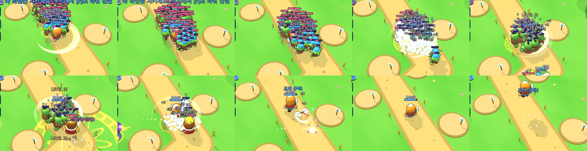 |
| **클레릭** | **근접 카메라(위자드)** |
| 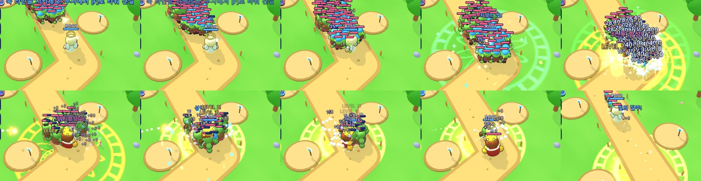 | 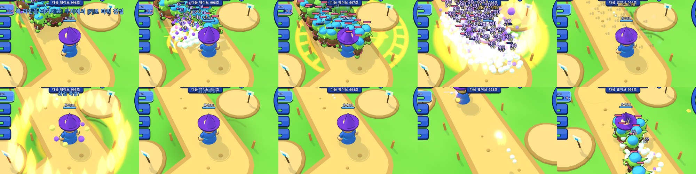 |
