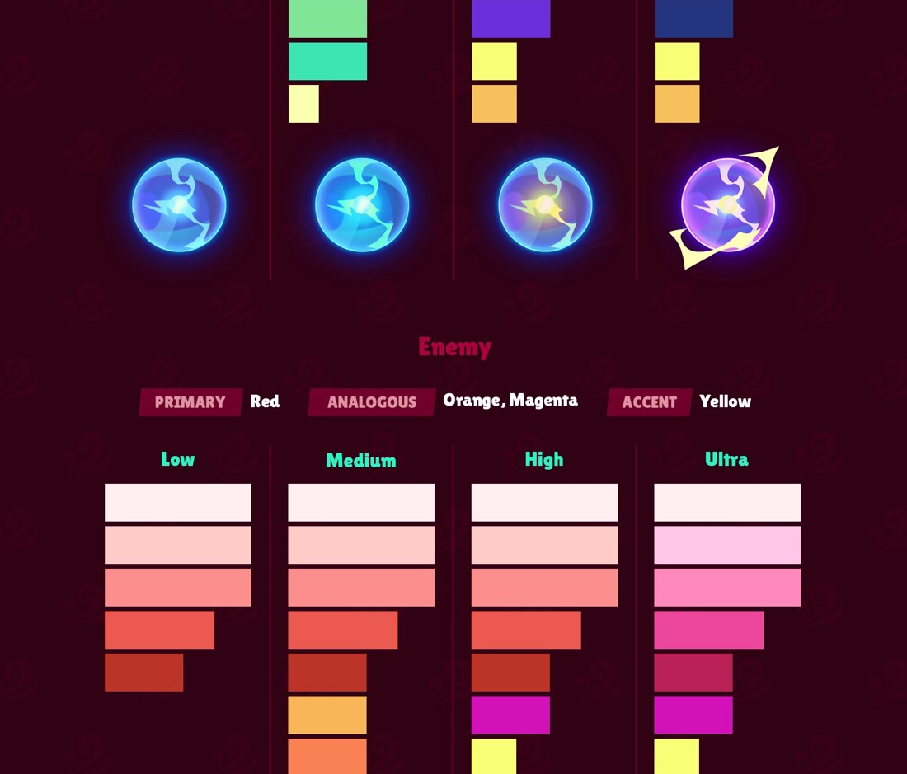
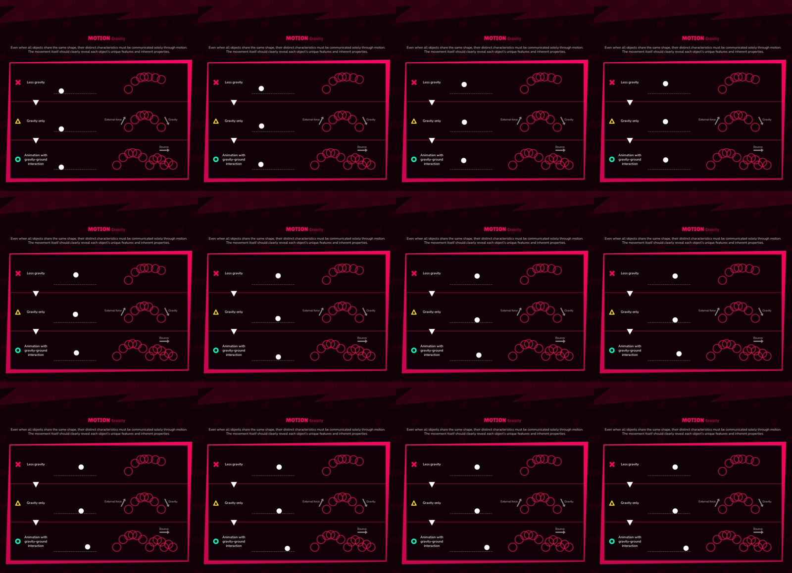
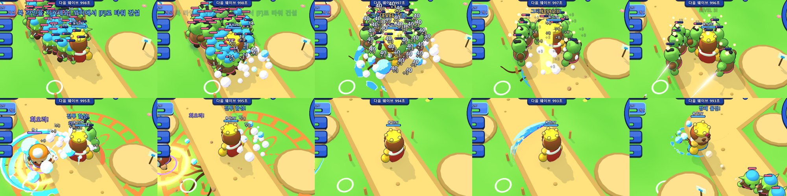
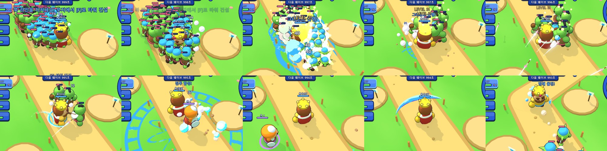
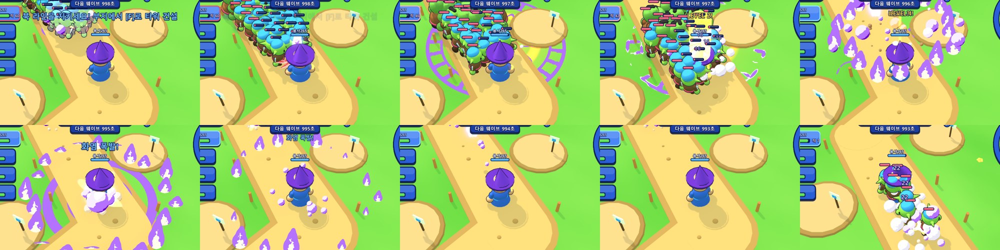
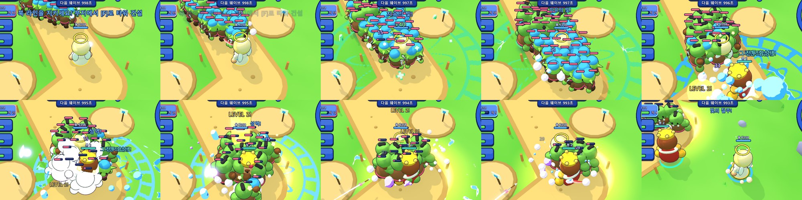
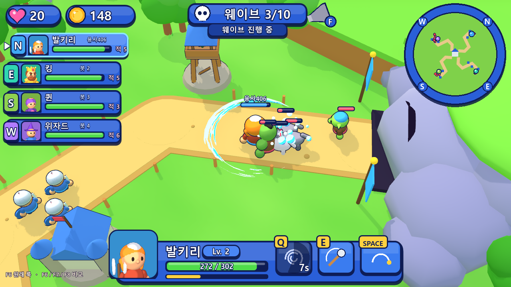

# 카툰 FX & 모션 가이드 분석과 TOY RUSH 적용

> 원문: 사내 노션 「(기초지식) 캐쥬얼 게임아트 퀄리티 가이드 - 카툰 FX & 모션」 (공용아트팀, 출처: 옥토포 스튜디오 **Cartoon FX Playbook**)
> 첨부 원본 11개(이미지 5장, 움짤 6개)를 모두 열람해 분석했다. 원본은 `refs/playbook/`에 있다.
> 이전 버전 문서에서 공개 자료로 추정했던 규칙 중 원본과 다른 부분(예: 날카로운 바늘·쐐기 도형)은 이번에 바로잡았다.

---

## 1. 플레이북 구조

| 장 | 항목 |
|---|---|
| WORK FLOW | Ideation(마인드맵 키워드) → Sketch(실루엣 / VFX 스케치) → Concept Art → **Asset Creation(심볼 → 에셋 → 조합)** |
| STYLE GUIDE | Saturation, Value, Color(시스템·테마), Shape(오브젝트·크기·계층·불·물·연기), Motion(중력·캐릭터), Design |
| CHECKLISTS | Game Play / Art / Work Flow 체크리스트 |

## 2. 원본 분석

### 2.1 채도 (Saturation)
- 너무 높은 채도는 배경과 어울리지 않고, 너무 낮은 채도는 배경과 구분되지 않는다. **중간 채도의 선명한 그라디언트**를 쓴다.

### 2.2 명도 (Value)
- 명도 차가 너무 작으면 톤 구분이 흐려지고, 너무 크면 대비가 과하다.
- 2단(✕) 대신 **밝음·중간·어두움 3단**(○)으로 나눈다. 흑백으로 바꿔도 형태가 읽혀야 한다.

### 2.3 컬러 시스템 (가장 중요)

- "**팀마다 주색을 정하고 유사색으로 풍부하게, 임팩트는 노랑 같은 강조색으로.**"
- 원본 스와치를 픽셀 단위로 직접 추출한 값:

| 팀 | 등급 | 밝음 → 어두움 | 추가 유사색/강조 |
|---|---|---|---|
| 아군 (주색 파랑, 유사색 초록·보라) | Low | `#bbfbfc` `#51f7fa` `#45b9fd` `#4669e1` `#25347e` | — |
| | Medium | 동일 | 초록 `#80e597` `#3de4b4` + 연노랑 |
| | High | 동일 | 보라 `#6c2ddb` + 노랑 `#f5f572` `#f5c565` |
| | Ultra | `#f7edfe` `#d6b1fb` `#b475fe` `#9200fa` `#6a00c3` | 노랑 강조 |
| 적 (주색 빨강, 유사색 주황·마젠타) | Low | `#ffeeef` `#fecbc8` `#fc8f8e` `#eb5951` `#bc3328` | — |
| | Medium | 동일 | 주황 `#f8b658` `#f98153` |
| | High | 동일 | 마젠타 `#d311b9` + 노랑 |
| | Ultra | `#ffeeef` `#ffc6e7` `#ff89bc` `#ed479d` `#b82056` | 마젠타 + 노랑 |

- 3.gif: 같은 효과가 **아군 파랑 / 적 빨강·분홍 두 벌**로 존재한다. 형태는 같고 팀 색만 다르다.
- **테마별 색상**: 색의 종류와 비율은 컨셉이 정한다. 단 "용암과 타르" 같은 테마도 **아군이면 파랑·보라 계열**로 칠한다. 팀 색이 테마보다 우선한다.

### 2.4 형태 (Shape)
- **둥글고 부풀린 형태**를 쓴다. 직선과 뾰족한 각은 피한다. 삼각형과 별도 모서리를 둥글린다.
- **읽기 쉬운 실루엣**: 흰색 단색으로도 정체가 드러나야 한다.
- **크기 계층**: 같은 크기만 반복하면 단조롭다. 강·중·약 크기 차와 **불규칙한 간격**을 둔다(3분할 구도).
- **불 (7.gif)**: 날카로운 불꽃 ✕ → 둥근 불꽃 ○. 아래쪽이 둥근 배, 위는 둥근 끝, 흔들릴 때도 둥글다.
- **물 (8.gif)**: 복잡한 묘사 ✕ → 단순한 묘사 ○. 시퀀스는 **흰 섬광 → 단색 형태 → 덩어리로 깨짐 → 작아지며 소멸**.
- **연기 (9.gif)**: 같은 규칙이다. 연기 고리가 흰 섬광으로 시작해 **조각으로 갈라지고, 조각이 줄어들며 사라진다.** 투명도 페이드는 쓰지 않는다.

### 2.5 움직임 (Motion)

- 중력 (5.gif): 중력 부족 ✕ → 중력만 △ → **외력 + 중력 + 지면 바운스** ○.
- 캐릭터 (6.gif): 같은 원이라도 **잎·젤리·공·돌**은 낙하, 회전, 착지가 다르다. 움직임만으로 재질이 드러나야 한다.

### 2.6 에셋 제작과 디자인
- 2.webp: **흰색 심볼**(가시 물방울, 소용돌이, 4각별, 초승달) → 색을 입힌 **에셋** → **조합**. 각 심볼은 반복 수정이 쉽게 구조화하고, 움직임은 오브젝트 특성에 맞춘다.
- 10.webp: 회색 기본 형태 → 특징 추가 → 디테일 → 꼬리(움직임 표현) → 팀 색 칠하기.

### 2.7 체크리스트 (11.webp)
| 분류 | 항목 |
|---|---|
| 가독성 | 모바일 크기에서 실루엣이 명확한가 / 효과가 겹쳐도 읽히는가 / 핵심 정보가 즉시 전달되는가 / **불필요한 지연이나 잔상은 없는가** |
| 깔끔함 | 모든 오브젝트와 입자에 목적이 있는가 / 입자 수와 디테일을 통제했는가 / 모바일 최적화 |
| 매력 | 신선한 컨셉 / 기능과 재미의 균형 |
| 캐릭터 정체성 | 성격이 반영되었는가 / 색·움직임·형태 언어가 일관적인가 / 다른 스킬과 분명히 구분되는가 |
| 형태 | 흰색 단색으로도 식별되는가 / 둥글고 볼륨 있는가 / 크기 변화가 있는 리듬 구성인가 |
| 색 | 채도와 명도의 균형 / **상태별 색상 코드(회복·피해·버프)** / 등급과 컨셉에 맞는 색 |
| 움직임 | 고유 특성과 외력 반영 / **중력 일관성** / 상태에 맞는 방향 / 이징 |
| 워크플로 | 키워드 / 레퍼런스 / 도형 실루엣 탐색 / 등급에 맞는 요소 / **인게임 벡터 시퀀스 금지** |

## 3. TOY RUSH 적용 규칙

### 3.1 색: 팀 색이 최우선
| 대상 | 팔레트 (주 / 어두움 / 밝음 / 강조) |
|---|---|
| 킹 | 아군 **High** (파랑 + 보라 음영 + 노랑 강조) |
| 퀸 | 아군 **Medium** (파랑 + 초록 강조) |
| 위자드 | 아군 **Ultra** (보라). 불 테마도 아군이므로 **보라 불꽃** |
| 발키리 | 아군 **Low** (청록) |
| 클레릭 | 아군 밝은 하늘색 (신성) |
| 궁수탑·병영·병사 / 마법탑 / 대포 | 아군 Low / Ultra / High |
| 일반 적 / 샤먼 / 흑기사 / 오우거 | 적 Low / High / Medium / **Ultra** |
| 상태 코드 | 회복 초록, 보호 하늘, 기절 노랑, 감속 연하늘, 골드 금색, 흙·연기·돌 중립색 |
| 플레이어 색 | 빨강을 적 전용으로 비우기 위해 **P2 빨강 → 청록, P4 노랑 → 보라** (모두 아군 계열) |

### 3.2 형태
- 모든 연기와 폭발은 **둥근 3톤 셀 덩어리**이고, 크기 계층(1 강 / 2 중 / 3 약)을 지키며 황금각으로 불규칙하게 배치한다.
- 불꽃 텍스처를 **둥근 배 + 둥근 끝** SDF로 교체했다. 높이도 강·중·약으로 나눈다.
- 베기 효과는 머리가 두껍고 끝이 둥근 **3톤 단색 초승달**이다. 꼬리부터 침식되며 사라진다.

### 3.3 움직임
- **단일 중력 G = 14**: 파편, 불똥, 낙하 입자가 모두 같은 중력을 쓴다.
- 파편은 착지 후 **지면 바운스**한다. 재질별 반발력은 돌 0.28, 젤리 0.5(착지 시 찌그러짐), 불똥 0.18이다.
- 회복 십자는 위로(상태 방향), 피격 덩어리는 바깥으로, 기절 별은 머리 위를 공전한다.

### 3.4 소멸: 투명도 페이드 금지
- 덩어리는 오버슛으로 부풀었다가 **2~3조각으로 깨지고**, 각 조각은 Back 이징으로 **작아지며 사라진다.**
- 바닥 링과 장판은 **노이즈 침식(디졸브) + 밝은 가장자리**로 타 들어가며 사라진다.
- 장판 수명은 최대 1.4초로 줄였다(잔상 금지).

### 3.5 가독성·깔끔함 예산
| 장치 | 규칙 |
|---|---|
| 우선순위 | 3 항상 / 2 스킬·내 타격 / 1 다른 영웅 타격 / 0 타워·병사·먼지·트레일 |
| 활성 예산 | 동시 110개. 60%를 넘으면 순위 0은 생략하고, 100%를 넘으면 순위 1도 생략 |
| 데미지 숫자 | 대상별 0.22초 합산. 0.25초 창마다 **내 숫자 최대 3개, 남의 숫자 1개**(남의 숫자는 작고 흐리게) |
| 골드 팝업 | 10G 미만 처치는 코인과 HUD 숫자만 표시 |
| 입자 | 파티클 1회 최대 8개, 예산 50%를 넘으면 1/3로 줄임 |
| 트레일 | 투사체 트레일 간격 0.03초 → 0.07초 |

## 4. 구현 구조 (이전 방식 대비 고도화)

| 이전 | 지금 |
|---|---|
| 효과마다 StandardMaterial을 새로 만들고 알파로 페이드 | **카툰 마스터 셰이더 하나**(`fx_cartoon.gdshaderinc`): 3색 밴드(명도 3단), 셀 볼륨 조명, 침식 디졸브 + 가장자리 하이라이트, 불꽃·스트립·평면 모드. 반투명 정렬 문제가 없는 **알파 시저(불투명 패스)** |
| 색을 효과마다 하드코딩 | `instance uniform`으로 인스턴스 색과 디졸브를 바꿈. 머티리얼은 공유해 배칭에 유리 |
| 영웅마다 임의의 팔레트 | **원본에서 추출한 팀 × 등급 팔레트**(`Fx.ALLY` / `Fx.ENEMY` / `Fx.STATE`) |
| 부드러운 반투명 구름 | 3톤 셀 덩어리 → 깨짐 → 축소 (`Fx.clump`, `Fx.cluster`) |
| 파편 중력 제각각, 바닥 관통 | 단일 중력, 해석적 탄도 + 지면 바운스, 재질별 반발력 (`Fx.chunks`) |
| 효과 무제한 | 우선순위 + 활성 예산 + 화면 밖 생략 (`Fx.ok`) |
| 데미지 숫자 난무 | 합산 + 창별 상한 + 내 피해 우선 |
| 기존 호출부 | `Vfx.puff / ground_ring / pop_sprite / sparks / debris / death_poof`를 **Fx로 연결**해 기존 효과 전체가 자동으로 규칙을 따름 |

파일: `scripts/fx.gd`(코어), `scripts/fx_cartoon.gdshaderinc`, `fx_cartoon.gdshader`(알파 시저), `fx_cartoon_add.gdshader`(가산), `scripts/octo.gd`(조합 효과), `scripts/mats.gd`(심볼 텍스처: 둥근 불꽃, 크랙, 룬, 십자 등).

## 5. 결과

| 적용 전 (킹) | 적용 후 (킹) |
|---|---|
|  |  |
| **위자드 (보라 = 아군 Ultra, 둥근 불꽃)** | **클레릭 (회복 = 초록 상태 코드)** |
|  |  |

### 5.1 체크리스트 자체 점검
| 항목 | 결과 |
|---|---|
| 겹쳐도 읽히는가 | ✔ 광역기 데미지 숫자 30여 개 → 3개 이하 |
| 지연·잔상 없음 | ✔ 타격 ≤ 0.35초, 장판 ≤ 1.4초, 영혼 위습 제거 |
| 입자 수 통제 | ✔ 예산과 우선순위 |
| 상태별 색상 코드 | ✔ 회복 초록, 기절 노랑, 골드 금색 / 적은 빨강 계열만 사용 |
| 등급에 맞는 색 | ✔ 기본 Low~Medium, 스킬 High, 궁극·보스 Ultra |
| 둥근 형태 | ✔ 불, 연기, 베기, 결정 모두 둥글게 |
| 크기 리듬 | ✔ 강·중·약 크기 계층, 황금각 배치 |
| 중력 일관성 | ✔ G = 14 단일, 지면 바운스 |
| 벡터 시퀀스 금지 | ✔ 셰이더와 메쉬 절차 생성 |
| 흰색 실루엣 식별 | △ 효과는 충족. 캐릭터 모델은 프리미티브 조합의 한계가 있음 |
